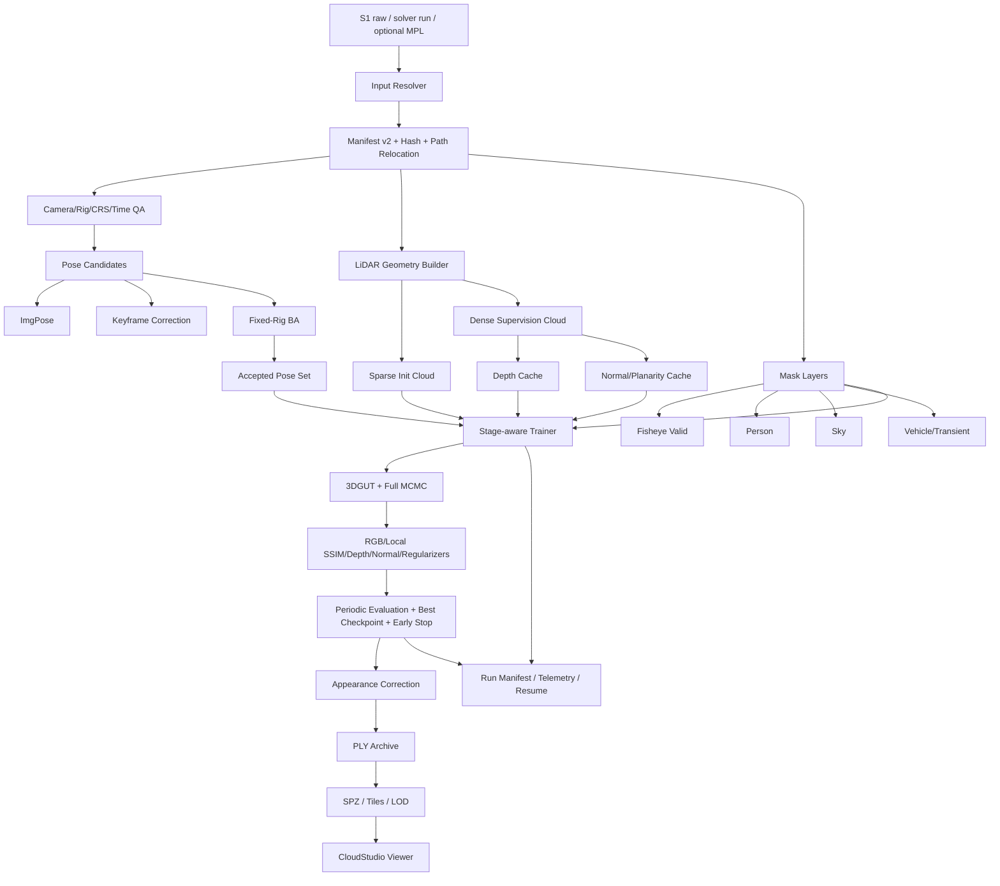

# CloudStudio 3DGS 行业级算法深度调研、现状复盘与 Codex 实施计划

> 面向仓库：`yang498-Peter/cloudstudio-3dgs`  
> 仓库基线：`master@c80d890d84adb411e983c08dfcb3264d5ed294af`  
> 调研日期：2026-08-21  
> 目标：将当前 MVP S1 双鱼眼 + SLAM/LiDAR 的 3DGS 原型，升级为可复现、可诊断、几何可信、质量可验收、资源可控、可中断恢复并可产品化交付的行业级处理软件。  
> 本文用途：作为后续 Codex 开发迭代的 plan of record，替换“按功能列表连续开发”的推进方式，改为“按真实证据和质量 Gate 逐项关闭”。

---

## 0. 给 Codex 的执行结论

当前项目不缺路线，不缺外围模块，最缺的是**把已经开发的数据、位姿、深度、动态 Mask 和 Trainer 真正组成一条高质量、可比较、可复现的真实训练链**。

从现在开始，执行优先级应调整为：

1. **停止继续扩张低优先级外围功能。**
2. **先关闭完整 MCMC CUDA 运行门。**
3. **把自有 Trainer 从“最小可运行实现”补到合格的高质量 3DGS 基线：**
   - KNN/PCA 尺度初始化；
   - 球谐颜色及分阶段开启；
   - 局部、Mask-aware SSIM；
   - 学习率调度；
   - 深度鲁棒损失；
   - 尺度、透明度和异常形状正则；
   - 周期评估与早停；
   - 中断恢复一致性。
4. **将 LiDAR 初始化点云与 LiDAR 监督点云分离。**
5. **在固定数据和固定验证集上完成单变量 A/B，先证明：**
   - Stage-2 Rig BA 是否提升最终 3DGS；
   - LiDAR depth 是否提升几何；
   - normal 是否进一步降低墙面厚度和 floaters；
   - Rig pose refinement 是否还有必要。
6. **再实现 factor 4 → factor 2 → 原图 crop 的粗到细训练。**
7. **随后处理曝光/颜色、天空、车辆及未知瞬态。**
8. **最后做 LOD、分块、SPZ 和 CloudStudio 产品接入。**

必须坚持：

> **源码完成 ≠ 合成测试完成 ≠ 真实数据运行完成 ≠ 画质改善完成 ≠ 产品验收完成。**

每个能力必须分别记录这五种状态，不得用前一层证据替代后一层。

---

# 1. 调研依据、证据等级与边界

## 1.1 主要输入

本报告建立在四类证据上：

### A. 用户提供的 MipMap 调研报告

文件：`2026-08-21_MipMap_LiDAR_3DGS算法流程调研分析报告.zh-CN.md`

该报告将证据分为：

- A：官方文档直接确认；
- B：安装包、DLL、依赖、模型和日志的本机直接证据；
- C：目标 `.mpl`、影像和 LAS 的真实数据实测；
- D：由 A/B/C 组合得到的工程推断。

本报告延续这一分级，不把闭源 DLL 中“存在某个符号”直接写成“所有质量档一定使用该能力”，也不把未知的默认步数、损失公式和权重写成事实。

### B. 当前仓库直接审查

审查对象包括：

- 当前 `master` 分支和最新提交；
- `cloudstudio_3dgs/training/`；
- `cloudstudio_3dgs/data/`；
- `cloudstudio_3dgs/geometry/`；
- `cloudstudio_3dgs/ba/`；
- `baselines/`；
- `docs/IMPLEMENTATION_PLAN.zh-CN.md`；
- `NOTICE.md`；
- 上游锁和 Windows CUDA 构建脚本。

### C. 当前项目真实基线

主要包括：

- 真实 gs2 数据的 1238 张有位姿鱼眼图；
- 619 个双目 Rig Frame；
- 376,906 点 voxel 初始化；
- 1238/1238 LiDAR ray-range cache；
- 1114 张训练图的 ALIKED + LightGlue + HLoc；
- 真实固定 Rig BA；
- 1238/1238 person mask 和 BA 高残差审计；
- 80 步合成 CUDA Trainer 验收；
- 历史 `2026-08-19_11-51-14-ff` 666 图、3000 步结果。

### D. 外部官方资料和论文

重点复核：

- gsplat；
- 3DGUT；
- 3DGS-MCMC；
- DN-Splatter / AGS-Mesh；
- 2D Gaussian Splatting；
- PGSR；
- iKalibr 和连续时间多传感器标定；
- TLC-Calib；
- PPISP；
- SpotLessSplats、T-3DGS、RobustSplat；
- VastGaussian、Octree-GS、LODGE；
- SPZ；
- 可选单目深度方案及其许可证边界。

## 1.2 明确边界

本报告不主张：

- 复制 MipMap 的闭源实现；
- 引入或改写受限许可证的 INRIA 3DGS、2DGS 等实现；
- 仅凭静态 DLL 字符串确认 MipMap 的精确训练配置；
- 仅凭合成训练结果宣布真实 S1 画质已经提升；
- 仅凭 PSNR 判断重建质量；
- 仅凭 LAS 含 `gps_time` 就对已解算点云重复做运动补偿。

---

# 2. 核心判断

## 2.1 对 MipMap 的判断

MipMap 的主要优势不是某个单独的秘密公式，而是将以下环节组织成了完整产品管线：

```text
传感器语义明确的数据描述
→ 时间、坐标、相机和路径预检
→ 位姿/空三修正
→ LiDAR 初始化与几何监督
→ 动态高斯管理
→ 动态物、颜色和天空处理
→ 多级训练
→ LOD / 分块 / 压缩输出
```

用户提供的调研证据表明，其 LiDAR 3DGS 具有或至少预留了：

- `.mpl` 中的相机、影像、POS、姿态、时间、LAS 和 CRS；
- LiDAR `gps_time`；
- SIFT/PnP/AT 位姿修正；
- 点云、网格深度和法线；
- 单目深度；
- RGB、SSIM、深度、法线、透明度、尺度、天空等损失接口；
- Split、Clone、Cull、Relocate、AddNewGS、Opacity Reset；
- 颜色一致化；
- 人物消除；
- 天空/背景；
- LOD、SOG 和 SOG Tiles。

但报告也明确指出：准确默认步数、具体损失公式、权重和阶段切换规则仍未通过完整动态任务确认。

## 2.2 对当前项目的判断

当前项目已经完成了非常有价值的前半段：

- 数据身份；
- 输入哈希；
- 局部坐标约束；
- 固定双鱼眼 Rig；
- 严格 train/val split；
- 真实 ALIKED + LightGlue；
- 固定 Rig BA；
- LiDAR voxel 初始化；
- 完整 LiDAR ray-range cache；
- 独立 person mask；
- 自有 raw-fisheye 3DGUT Trainer；
- Rig-aware pose refinement；
- fail-closed 和签名 baseline。

这部分已经高于大量只追求“能训练”的研究仓库。

但当前系统的核心训练器仍然是：

> **为证明数据契约、3DGUT、MCMC API、Mask、Depth 和 Checkpoint 能够闭环而写的最小训练器，而不是高质量生产 Trainer。**

因此当前成熟度应定义为：

```text
数据与控制面：V0.8
位姿与几何准备：V0.75
训练质量核心：V0.4
真实客户画质验证：V0.3
大场景和产品交付：V0.2
```

综合定位：

> **V0.7：算法基础设施成型，尚未完成高质量真实训练和产品验收。**

---

# 3. 当前仓库事实快照

## 3.1 已完成并有真实证据的能力

| 能力 | 当前状态 | 真实证据 | 结论 |
|---|---|---:|---|
| Canonical Manifest | 完成 | 真实 S1 数据完整哈希和确定性重放 | 可作为数据根身份 |
| 固定双鱼眼 Rig | 完成 | 619 个完整 Rig Frame | 方向正确 |
| 定量数据 QA | 完成 | 室内/室外配置和 overlay | 仍需更多场景校准阈值 |
| LiDAR voxel 初始化 | 完成 | 28.4M → 376,906，覆盖优于 stride | 初始化路线正确 |
| Rig-aware split | 完成 | 1114 train / 124 val | 修复历史左右拆分泄漏 |
| ALIKED + LightGlue | 完成 | 1114 图、6787 对 | 真实运行通过 |
| HLoc triangulation | 完成 | 765,590 点，3,083,168 observations | 真实运行通过 |
| Fixed-Rig BA Stage 2 | 完成 | p50 1.593 → 1.079 px，改善 32.27% | 当前最佳 Pose 候选 |
| LiDAR ray-range cache | 完成 | 1238/1238，约 2.11 GB | 数据端完整 |
| Person masks | 完成基础版 | 1238 mask、2057 个实例 | 仅 person 类 |
| Person/BA residual audit | 完成 | 高残差落在人影内仅 1.5063% | 不建议重跑当前 BA |
| 自有 Trainer | 源码和合成 CUDA 完成 | 80 步 loss 改善 53.17% | 真实长训练未通过 |
| Rig pose refinement | 源码/合成完成 | 共享 Rig delta、回退门 | 真实 A/B 未运行 |
| 完整 Windows CUDA build recipe | 已提交 | 解释了 MCMC 算子缺失根因 | 运行验收仍需单独关闭 |

## 3.2 仍然不能宣布完成的能力

| 能力 | 当前事实 |
|---|---|
| 完整 MCMC | 已有全 kernel 构建方案，但尚无新的完整 GPU acceptance 证据 |
| 真实 LiDAR depth loss | 数据完整，Trainer contract 通过，但真实 CUDA 训练仍未运行 |
| Stage-2 BA 对最终 3DGS 的提升 | BA 本身有效，但 3DGS A/B 未运行 |
| Rig pose refinement 实际收益 | 只有源码/合成证据 |
| Person mask 对最终画质的提升 | Mask 和审计完成，3DGS A/B 未运行 |
| 原图高分辨率训练 | 未实现多阶段系统 |
| 法线监督 | 未实现 |
| 曝光/颜色一致化 | 未实现 |
| 天空/远背景 | 未实现 |
| 单目深度补洞 | 未实现 |
| LOD/分块/压缩交付 | 未实现 |
| 行业级任务服务 | 尚未形成完整服务状态机 |

---

# 4. 当前自有 Trainer 的关键代码审查

这是本轮审查最重要的部分。

## 4.0 直接代码审计矩阵

| 文件 | 当前实现 | 主要限制 | 下一步 |
|---|---|---|---|
| `training/backend.py` | 固定 RGB、统一 5 cm scale、identity quaternion、classic raster、MCMC API | 无 SH；无 KNN/PCA；无 anti-alias；初始化忽略局部密度与法线 | Gate 2 |
| `training/losses.py` | masked L1、全局统计式 masked SSIM、confidence L1 range | 非局部 SSIM；无 log/Huber；无 normal/scale/opacity | Gate 2/4 |
| `training/trainer.py` | 单 factor/crop、固定 max steps、final eval、checkpoint、Rig refine | 无多阶段；无周期 eval/best ckpt/early stop；无 LR schedule | Gate 2/6 |
| `data/depth_cache.py` | 确定性 sparse cache、签名、完整性检查 | 当前监督源仍主要来自 376,906 点 init PLY；LAS >5M 默认拒绝无界加载 | Gate 4 |
| `geometry/lidar_projection.py` | KB4、nearest rounded pixel、Euclidean range、front z-buffer | 单像素 footprint；无 normal；无 local plane/edge confidence | Gate 4 |
| `data/person_masks.py` | 独立签名 person layer、人工抽检资产、训练 fail-closed | 仅 person；鱼眼边缘 recall 未量化；外部人工复核未完成 | Gate 7 |
| `training/rig_pose.py` | 每 Rig Frame 共享 6DoF、先验、回退 | 真实训练收益未知；BA 后边界应更紧 | Gate 5 |
| `ba/*` | 真实固定 Rig BA、Stage 2 accepted | 尚未证明最终 3DGS 画质提升 | Gate 5 |
| `train/*machine_b*` | 完整 kernel 构建方案 | 构建 recipe 不等于 runtime acceptance | Gate 1 |

## 4.1 当前 Trainer 的优点

当前 Trainer 已经做到：

- 只消费签名 Manifest；
- 原始鱼眼 + 3DGUT；
- RGB mask 与 depth mask 分离；
- person mask 同时排除 RGB/SSIM/depth；
- LiDAR 语义为 Euclidean ray range；
- 固定 split；
- 坐标不 normalization；
- checkpoint 保存参数、Adam、MCMC state、采样器和 RNG；
- Rig pose refinement 可保存和恢复；
- 输出签名 run manifest；
- 缺数据 fail-closed；
- 不依赖 Viewer；
- 不再长期修改上游 example。

这些是行业级框架的良好基础。

## 4.2 当前颜色模型仍然过于简化

当前 Backend 使用：

```text
每个 Gaussian 一个 sigmoid RGB
```

没有：

- SH0/SHN；
- 视角相关颜色；
- SH degree schedule；
- appearance embedding；
- per-camera/per-frame photometric correction。

影响：

- 高光、反射、材质角度变化无法正确表示；
- 左右鱼眼或不同帧曝光差容易被几何、透明度和额外 Gaussian 吸收；
- 视角相关区域会模糊或出现颜色漂移；
- 无法直接对接标准带 SH 的 PLY/SPZ 交付。

### 建议

第一阶段恢复标准球谐：

```text
Stage A：SH degree 0
Stage B：逐步打开到 degree 2
Stage C：必要时 degree 3
```

不要从第一步就开放高阶 SH，以免在位姿和几何尚未稳定时用视角颜色作弊。

## 4.3 初始化尺度不合理

当前所有点统一：

```text
scale = 0.05 m
quaternion = identity
```

这忽略了：

- LiDAR 点密度随距离变化；
- 不同区域的局部间距；
- 墙、地面与植被的局部几何；
- 扫描轨迹造成的各向异性采样。

上游 gsplat 示例至少使用 KNN 邻距初始化尺度。DN-Splatter 还提供了利用点云法线初始化尺度/旋转的思路。

### 建议分三层实验

1. **KNN isotropic**
   - 3 个近邻平均距离；
   - clamp 到合理范围。

2. **PCA anisotropic**
   - 局部协方差特征值决定三个尺度；
   - 最小特征值方向作为 normal；
   - 只对高 planarity 点启用。

3. **混合初始化**
   - 平面点：normal-aligned anisotropic；
   - 植被/粗糙点：KNN isotropic；
   - 低置信点：保守小尺度。

## 4.4 当前 SSIM 不是标准局部结构 SSIM

当前 `masked_rgb_ssim_loss` 在所有有效像素上计算全局通道均值、方差和协方差。

它不是常见的滑动窗口 SSIM。

影响：

- 不能充分强调局部边缘、纹理和小结构；
- 对大范围亮度和颜色统计较敏感；
- 很难直接与其他 3DGS 论文或竞品常见 SSIM 训练配置对应。

### 建议

实现 Mask-aware local SSIM：

- 11×11 或可配置窗口；
- 只在窗口有效像素覆盖率达到阈值时计入；
- 边缘可选梯度权重；
- 保留当前 global masked SSIM 作为诊断指标，不作为主要训练 loss。

## 4.5 当前深度损失过于基础

当前使用：

```text
confidence × |predicted range - LiDAR range|
```

不足：

- 远距离误差绝对值天然更大；
- 深度边缘噪声可能主导；
- 异常点没有 Huber/Cauchy；
- 没有 log-range；
- 没有法线；
- 没有点到平面；
- 没有表面厚度约束。

DN-Splatter 对传感器深度推荐 EdgeAwareLogL1，并支持 Huber、LogL1、normal loss 和 normal TV。

### 建议候选

主候选：

\[
L_{range}
=
w_i \cdot \mathrm{Huber}
\left(
\log(r_{pred}+\epsilon)-\log(r_{gt}+\epsilon)
\right)
\]

置信度包含：

- 原始投影支持数；
- 亚像素误差；
- 局部深度边缘；
- 局部点密度；
- normal planarity；
- person/sky/transient mask；
- 距离范围。

## 4.6 缺少几何正则

当前没有：

- opacity regularization；
- scale regularization；
- scale ratio / anisotropy regularization；
- surface thickness；
- depth distortion；
- normal consistency；
- single-view support regularization；
- LiDAR anchor distance。

这使 RGB loss 仍可能通过：

- 过大 Gaussian；
- 针状 Gaussian；
- 低 opacity 雾；
- 离开 LiDAR 表面的浮空 Gaussian；
- 单视图作弊

来降低 loss。

## 4.7 当前训练只有单阶段

当前配置只有：

- 一个 factor；
- 一个固定 crop；
- 一个 max_steps；
- 固定 loss weight；
- 固定学习率；
- 固定 MCMC 配置。

没有：

- factor 4 → factor 2 → factor 1；
- checkpoint 跨 stage；
- 不同 stage 的 loss schedule；
- SH schedule；
- pose freeze；
- densification stop；
- geometry/appearance learning-rate schedule；
- stage-specific cap。

## 4.8 当前只有终点验证

当前 Trainer 在训练结束后才输出完整 validation。

没有：

- 周期 golden-set eval；
- full validation at stage boundaries；
- LPIPS 在线趋势；
- depth trend；
- Gaussian 数量变化；
- relocation/add/prune 统计；
- early stop；
- best checkpoint；
- regression rollback。

## 4.9 当前渲染器未使用抗锯齿模式

当前固定：

```text
rasterize_mode = classic
packed = false
```

`packed=false` 是锁定版本 3DGUT/UT 兼容约束，不能为了省显存直接改。

但 `classic` 在多分辨率和远视角中可能产生 aliasing。gsplat 提供 antialiased 选项，Mip-Splatting、2DGS 和后续 anti-aliasing 工作也都说明频率与采样一致性的重要性。

### 建议

将抗锯齿作为独立兼容性实验，不要默认打开：

- 先验证当前锁定 3DGUT 是否支持；
- 对 factor 1/2/4 和远视角测试；
- 比较 LPIPS、细线闪烁、zoom-out；
- 记录模型导出是否需要 antialiased flag。

---

# 5. LiDAR 数据和几何监督的深入审查

## 5.1 初始化点云与监督点云不能继续共用同一预算

当前完整 depth cache 使用 376,906 点 voxel 初始化 PLY 生成。

这虽然可重复且已形成大量有效像素，但从设计上存在问题：

```text
初始化点数需要小
监督点数需要密
```

### 初始化点云目标

- 30–60 万；
- 给 MCMC 留增长空间；
- 控制显存；
- 空间覆盖均匀；
- 允许边缘/平面适度加权。

### 监督点云目标

- full LAS 或 2–4 cm voxel；
- 可达数百万至上千万；
- 离线投影；
- 不进入 GPU Gaussian 参数；
- 用于 depth、normal、point-to-plane 和评估。

### 建议新增资产

```text
geometry/
├── initialization_cloud.ply
├── supervision_cloud.laz|ply
├── normal_cloud.npz
├── depth/
├── normal/
└── geometry_manifest.json
```

## 5.2 当前深度投影是最近像素取整 z-buffer

当前流程：

```text
KB4 projection
→ uv round
→ 每像素保留最近 Euclidean range
→ confidence = subpixel × support
```

优点：

- 简单；
- 可复现；
- 遮挡前表面明确；
- 合成测试容易。

不足：

- 点投影到一个像素，容易产生孔洞；
- round 会产生离散 aliasing；
- support count 只是“落在同一像素的点数”，不等于表面可靠性；
- 没有考虑 LiDAR beam footprint；
- 没有局部面片；
- 没有 edge bleeding 控制；
- 没有 normal。

### 建议升级顺序

1. 保留现有 sparse cache 作为高置信锚点。
2. 增加 2×2 或小椭圆 footprint 的可选投影。
3. 只有局部 normal/plane 可靠时才扩散。
4. 在深度不连续边缘禁止跨边传播。
5. 对比：
   - sparse nearest；
   - dense footprint；
   - local plane rasterization；
   - mesh rasterization。
6. 不允许一上来用全局 mesh 替换 sparse LiDAR 真值。

## 5.3 LiDAR normal 是下一项高收益能力

建议从 supervision cloud 计算：

- kNN normal；
- eigenvalues；
- planarity；
- linearity；
- roughness；
- normal orientation confidence。

法线来源优先级：

1. LiDAR local PCA；
2. local plane / mesh；
3. rendered depth gradient；
4. 单目 normal，仅作补充。

法线损失：

\[
L_n = w_n (1 - |n_{render}\cdot n_{lidar}|)
\]

对以下区域降权：

- 植被；
- 低密度；
- 深度边缘；
- 玻璃；
- 反光；
- person/vehicle；
- 天空。

## 5.4 时间链必须审查，但不能盲目重做运动补偿

用户目标 `.mpl` 中：

- 666 张影像有时间戳；
- LAS 含 `gps_time`；
- LAS 时间范围覆盖图像；
- MipMap 官方将该关系视为手持 LiDAR 核心条件。

当前项目没有读取 per-point `gps_time`。

这值得增加，但必须先回答：

> 当前 `colorized.las` 是原始扫描点，还是 solver 已经 deskew 并变换到统一局部世界坐标的静态地图？

如果已经 deskew：

- 不应按 `gps_time` 再次对每个点施加轨迹变换；
- 否则会双重补偿；
- `gps_time` 主要用于 QA、颜色关联、传感器时间偏移审计。

如果是原始/半原始点：

- 才需要连续时间轨迹；
- 点级 deskew；
- camera/LiDAR time offset；
- rolling shutter/readout（若相机需要）。

### 建议在 Manifest v2 增加

```json
{
  "point_cloud_motion_state": "deskewed_local_map | raw_timestamped_points | unknown",
  "gps_time_semantics": "...",
  "trajectory_source": "...",
  "camera_timestamp_semantics": "...",
  "time_offset_applied_sec": 0.0
}
```

`unknown` 时禁止自动时间修正，只输出 QA 和候选搜索报告。

---

# 6. 位姿、Rig 和标定路线

## 6.1 当前 Fixed-Rig BA 已经足够作为主候选

当前 Stage-2 BA 已证明：

- p50 重投影改善超过 32%；
- p95 改善；
- Rig 基线基本无漂移；
- 场景尺度稳定；
- 焦距变化极小；
- Stage 3 畸变越界被拒绝。

因此短期不应该继续“升级特征和 BA 算法”，而应先完成：

```text
ImgPose 3DGS
vs
Stage-2 BA Pose 3DGS
```

## 6.2 Rig pose refinement 应降级为残差 polish

PR-12 当前默认边界为：

- 最大 0.25 m；
- 最大 2°；
- 最小 loss 改善 1%。

这些适合作为绝对安全上限，不适合作为 Stage-2 BA 后的正常工作范围。

建议在 BA Pose 后增加更紧的监控门：

- p50 translation 目标：毫米级；
- p95 translation 目标：厘米级以内；
- p50 rotation 目标：小于几百分之一度；
- 大修正说明 BA/标定仍有问题，应 fail，不应由 3DGS 吃掉。

真实策略：

```text
Stage A 初期可短暂启用
→ 候选对固定样本有改善
→ 修正量在严格范围内
→ 冻结并发布
否则回退 BA Pose
```

## 6.3 时间/外参联合优化应作为独立研究 Gate

iKalibr 和连续时间标定研究说明：

- 多传感器融合中的空间外参和时间偏移可联合优化；
- 连续时间 B-spline 更适合异步高频测量；
- 需要足够运动激励和可观测性。

TLC-Calib 进一步展示了利用 Gaussian scene 联合优化固定 Rig 外参的研究方向。

但对本项目：

- 先做标量 `Δt` 搜索；
- 再做极小外参 residual；
- 必须绑定强先验；
- 必须证明 LiDAR-image edge、depth 和 3DGS 同时改善；
- 不能把校准自由度与大规模 Gaussian 训练一次性全部开放。

---

# 7. 动态物、天空和外观

## 7.1 当前 Person Mask 基础版已可用于第一轮训练

当前真实 person pipeline 已具备：

- 独立签名 manifest；
- 1238/1238；
- 954 张有 person；
- 2057 instances；
- 左右各 25 张 Codex 视觉抽检；
- person 同时排除 RGB/SSIM/depth；
- BA 高残差并不集中在人影上；
- 不建议重跑当前 Stage-2 BA。

这足以进入第一轮 3DGS A/B。

仍需补：

- 外部人工复核；
- 鱼眼边缘、小人物和截断人体的 recall；
- false positive 的静态像素保护指标。

## 7.2 不要立即替换 Mask R-CNN

第一步应测量现有模型：

- person recall；
- static pixel recall；
- edge miss；
- 近/远人物；
- 鱼眼边缘。

只有真实漏检明显，才进入：

```text
透视面检测
→ SAM2 边界细化
→ 原鱼眼回映射
→ 时序传播
```

## 7.3 动态建模需要与 densification 解耦

RobustSplat 的核心启发是：

- 早期 densification 会把 transient 直接长成 Gaussian；
- 应先稳定静态场景，再开放增长；
- Mask 可以从低分辨率逐步细化到高分辨率。

因此建议：

```text
Stage A：
person/sky mask 生效
MCMC 延迟 aggressive growth

Stage B：
静态结构稳定后开放主要增长

Stage C：
高分辨率 mask 精修
停止大规模 densification
```

## 7.4 未知 transient 不应仅靠语义类别

后续研究路线：

- 多视角重投影残差；
- 同一 3D surface 的颜色/特征不一致；
- LiDAR 是否存在稳定表面；
- T-3DGS 的训练行为分类；
- SpotLessSplats 的 robust feature 思路；
- 双向时序传播。

不要直接复制这些项目代码；先核查许可证，并优先自研小型 residual classifier。

## 7.5 天空必须成为独立语义

第一版不必训练复杂 sky Gaussian。

最低要求：

- sky 不参加 LiDAR depth/normal；
- sky 不允许生成近距离高 opacity Gaussian；
- sky 从前景质量指标中分离；
- 输出可保留单独 background 层。

## 7.6 曝光和颜色

PPISP 是当前最值得研究的成熟开源路线：

- per-frame exposure；
- per-camera vignetting；
- per-frame color correction；
- per-camera CRF；
- novel-view controller；
- Apache-2.0；
- 已被 gsplat 集成。

但顺序必须是：

```text
Pose → Geometry → MCMC → Resolution → Appearance
```

先实现简化 A/B：

- per-camera 3×3 color matrix + bias；
- per-frame scalar exposure；
- 强 regularization。

只有简化模型证明有效，再接 PPISP。

---

# 8. 外部研究的可吸收结论

## 8.1 立即吸收

| 来源 | 可吸收能力 | 采用方式 |
|---|---|---|
| gsplat | 3DGUT、MCMC、depth、SH、anti-alias、PPISP | 继续作为核心 |
| 3DGS-MCMC | SGLD noise、relocation、点数预算 | 完整 runtime 与 telemetry |
| DN-Splatter | EdgeAwareLogL1、normal、normal TV、depth confidence | 在自有 Trainer 独立实现或合规复用 |
| PGSR | unbiased depth、normal、曝光补偿 | 研究公式，独立实现 |
| PPISP | 物理合理曝光/暗角/颜色/CRF | Geometry 稳定后接入 |
| iKalibr | 时间偏移、外参和连续时间思想 | 先做 QA，再做独立标定工具 |
| RobustSplat | 延迟增长、低到高分辨率 mask | 纳入训练 stage 设计 |
| SPZ | 压缩和坐标系统明确的交付格式 | 后期输出 |

## 8.2 作为研究对照，不直接引入代码

| 来源 | 原因 |
|---|---|
| 2DGS | 几何思想强，但官方实现继承 INRIA 非商业许可证 |
| Mip-Splatting | 需要独立许可证审查；优先用 gsplat 自带 anti-alias |
| TLC-Calib | 研究方向有价值，但仓库含 INRIA 许可链 |
| 多数基于原版 3DGS 的研究仓库 | 可能不能直接商用 |

## 8.3 延后

- 单目深度；
- 大场景 LOD；
- SOG；
- mesh-first 全流程；
- 复杂未知 transient 网络；
- 2DGS 主表示切换。

---

# 9. 目标行业级架构



## 9.1 四个逻辑平面

### 数据平面

- 原始文件；
- Canonical Manifest；
- Mask/Depth/Normal；
- Pose Set；
- 内容哈希。

### 算法平面

- BA；
- Geometry builder；
- Trainer；
- MCMC；
- Appearance；
- Export。

### 控制平面

- task graph；
- state machine；
- resume；
- GPU resource profile；
- OOM policy；
- retry；
- cancellation。

### 验收平面

- benchmark；
- golden views；
- image metrics；
- geometry metrics；
- performance；
- license ledger；
- signed reports。

---

# 10. 后续实施不再按“功能数量”，而按 Gate 推进

下面是应直接写入 `docs/IMPLEMENTATION_PLAN.zh-CN.md` 的新 plan of record。

---

## Gate 0：冻结 Benchmark v1

### 目标

建立后续所有判断的统一数据、split、指标、相机路径和竞品对照。

### 数据集

#### D1：主竞品数据

`2026-08-19_11-51-14-ff`

- 666 张原始鱼眼；
- 2×2912²；
- 15,288,196 LAS 点；
- `gps_time`；
- 历史 3000-step 结果；
- 可供 MipMap 使用的 `.mpl`。

#### D2：开发数据

gs2：

- 1238 图；
- 619 Rig Frames；
- 真实 BA；
- full depth；
- person masks。

#### D3：室内低纹理

现有 house/indoor 数据，用于：

- 白墙；
- 门洞；
- 楼梯；
- 低纹理 edge QA。

#### D4：后续动态/户外

至少包含：

- 人；
- 车；
- 植被；
- 天空；
- 强曝光变化。

### 交付

```text
benchmarks/v1/
├── datasets.json
├── splits/
├── golden_views/
├── trajectories/
├── metric_policy.json
├── baseline_registry.json
└── README.zh-CN.md
```

### 验收

- 所有输入 hash 固定；
- train/val 不变；
- 左右 Rig 同 split；
- 旧 3k 结果重新按同一 metric policy 评估；
- MipMap High/Ultra 后续运行时写入同一 registry；
- benchmark 输出可重复。

### 非目标

- 不修改 Trainer；
- 不引入新算法。

---

## Gate 1：完整 MCMC 与 GPU 可靠性

建议分支：

`fix/full-mcmc-windows-runtime`

### 工作

1. 使用最新 machine-B 构建方案完成全 kernel JIT。
2. 运行时验证所需 op：
   - covariance；
   - relocation；
   - sample add；
   - rasterization；
   - backward。
3. 合成训练开启真实 noise。
4. refine window 内记录：
   - Gaussian count；
   - relocate count；
   - new Gaussian count；
   - dead Gaussian count；
   - opacity distribution；
   - scale distribution。
5. 完成 interrupted resume：
   - 连续训练；
   - 中断后恢复；
   - 对比 step、Gaussian identity、loss、RNG 和 MCMC state。
6. 增加 NaN/Inf 检查和回滚。
7. 增加 GPU smoke 到 CI 或专用 self-hosted runner。

### 必改文件

- `train/setup_machine_b_no_admin.cmd`
- `train/env_machine_b.cmd`
- `tools/run_synthetic_training_acceptance.py`
- `cloudstudio_3dgs/training/backend.py`
- `cloudstudio_3dgs/training/checkpoint.py`
- `cloudstudio_3dgs/training/trainer.py`
- `tests/test_training.py`
- 新增 `baselines/full_mcmc_runtime.baseline.json`

### Exit Gate

必须同时满足：

- noise 非零；
- relocation/add 至少发生一次；
- Gaussian count 合理变化；
- 无 NaN；
- 恢复后继续 densification；
- checkpoint 与 uninterrupted 结果在规定容差内；
- runtime op 清单完整；
- 真实 GPU 证据写入 baseline。

### 不得声称

仅“编译成功”不能宣布 Gate 通过。

---

## Gate 2：Trainer 质量基础补齐

建议分支：

`feat/trainer-quality-foundation`

### 2.1 初始化

实现：

- KNN scale；
- 可选 PCA scale/orientation；
- scale clamp；
- normal confidence；
- initialization report。

### 2.2 颜色

实现：

- SH0/SHN；
- SH degree schedule；
- RGB-only compatibility；
- PLY export 支持标准 SH 字段。

### 2.3 损失

实现：

- local masked SSIM；
- robust log-range；
- opacity regularization；
- scale regularization；
- scale-ratio guard；
- optional edge-aware weight。

暂不在本 Gate 引入 normal loss。

### 2.4 优化器和调度

实现：

- means exponential decay；
- SH schedule；
- stage-aware LR multiplier；
- optimizer/scheduler checkpoint；
- fused Adam 可选；
- 每项 loss 单独 telemetry。

### 2.5 周期评估

实现：

- fast golden eval；
- full eval at configured steps；
- best checkpoint；
- LPIPS；
- geometry metrics；
- periodic render artifacts。

### Exit Gate

- 合成 raw-fisheye 收敛；
- 旧最小 Trainer 可作为 compatibility preset；
- 新 baseline 在 D1/D2 factor4 小预算下不低于旧 Trainer；
- SH/KNN/local SSIM 每项有独立 A/B；
- checkpoint 包含 scheduler/SH stage；
- full validation 不再只在终点运行。

---

## Gate 3：MPL、时间和传感器语义

建议分支：

`feat/mpl-and-sensor-time-qa`

### 工作

1. `.mpl` parser。
2. 路径重定位：
   - 原路径；
   - `.mpl` 相对根；
   - recording ID；
   - left/right/LAS 命名匹配。
3. CRS/source validation。
4. image timestamp 与 LAS gps_time coverage。
5. LAS motion-state 字段。
6. trajectory source。
7. coarse `Δt` search report。
8. 不自动发布时间修正，除非通过 Gate。
9. 输出 `sensor_alignment_report.json/html`。

### 时间偏移实验

候选区间示例：

```text
[-100ms, +100ms]
coarse: 5ms
fine: 0.5~1ms
```

目标函数可组合：

- LiDAR depth edge 到 image gradient；
- LiDAR intensity edge；
- feature boundary；
- multi-frame consistency。

### Exit Gate

- MPL 666/666 解析；
- path relocation 可重复；
- gps_time/CRS/源检查通过；
- 明确 point cloud motion state；
- `Δt` 候选只有在多帧和多场景一致时才可发布；
- 不发生 double deskew。

---

## Gate 4：稠密 LiDAR Depth 与 Normal

建议拆成两个 PR。

### PR-A：`feat/dense-lidar-supervision`

工作：

- initialization cloud 与 supervision cloud 分离；
- chunked LAS reader；
- 2/3/4 cm voxel sweep；
- sparse/footprint/local-plane 三种投影；
- edge-aware confidence；
- full cache streaming；
- disk budget report。

Exit：

- D1/D2 depth coverage、边缘泄漏和文件体积报告；
- dense cache 不改变 init Gaussian 数；
- sparse anchor 始终保留；
- 真实 Trainer depth loss 运行通过；
- geometry metric 有改善。

### PR-B：`feat/lidar-normal-supervision`

工作：

- PCA normal；
- planarity/roughness；
- normal orientation；
- per-pixel normal cache；
- rendered normal 或 depth-gradient normal；
- confidence-weighted normal loss；
- normal TV；
- point-to-plane metric。

Exit：

- 合成平面角误差通过；
- 室内墙地面 normal error 改善；
- planar thickness 降低；
- 植被不被过度平滑；
- RGB 不显著退化。

---

## Gate 5：真实 Controlled Ablation

建议分支：

`test/benchmark-v1-controlled-ablation`

不得同时打开所有功能。

### 第一轮：位姿和几何

| 实验 | Pose | MCMC | Depth | Normal | Person | Resolution |
|---|---|---|---|---|---|---|
| E0 | 历史 ImgPose | 旧退化 | Off | Off | Off | factor4 / 3k |
| E1 | ImgPose | Full | Off | Off | On | factor4 |
| E2 | Stage-2 BA | Full | Off | Off | On | factor4 |
| E3 | Stage-2 BA | Full | Sparse depth | Off | On | factor4 |
| E4 | Stage-2 BA | Full | Dense depth | Off | On | factor4 |
| E5 | Stage-2 BA | Full | Dense depth | On | On | factor4 |
| E6 | E5 + Rig refine | Full | Dense | On | On | factor4 |

### 决策

- E2 显著优于 E1：Stage-2 BA 成为默认。
- E6 未优于 E5：默认关闭 train-time pose refine。
- Dense depth 只提高像素数但不改善 geometry：回退 sparse/edge-aware。
- Normal 改善平面但损害植被：增加类别/roughness gate。

### Exit Gate

- 所有实验同一 split、mask、seed policy；
- 输出统一 HTML；
- 至少两个场景重复趋势；
- 结论绑定真实 baseline；
- 不允许只挑最好截图。

---

## Gate 6：粗到细原图训练

建议分支：

`feat/multistage-high-resolution-training`

### Stage A：Geometry

初始建议搜索范围，不是锁定值：

- factor 4；
- 4k–6k；
- SH 0→1；
- depth strong；
- normal strong；
- pose refine 可短开；
- 延迟 aggressive growth；
- cap 1.0–1.5M。

### Stage B：Main Reconstruction

- factor 2；
- full frame 或 1024 crop；
- 6k–10k；
- SH 2→3；
- pose frozen；
- depth/normal medium；
- MCMC 继续但接近停止；
- cap 1.5–2.5M，按 16GB probe。

### Stage C：Native Polish

- factor 1；
- 768/1024/1280 crop；
- 4k–8k；
- pose off；
- MCMC growth off 或极弱；
- geometry LR 0.1–0.3×；
- appearance LR 保持；
- edge/residual-aware crop；
- person/sky high-res mask。

### 必须实现

- checkpoint 跨 stage；
- per-stage optimizer policy；
- per-stage loss；
- valid-aware crop；
- edge/residual crop；
- VRAM probe；
- OOM fallback；
- best checkpoint；
- stage report。

### OOM 自动降级

顺序：

1. crop -128；
2. cap -15%；
3. SH degree -1；
4. depth/normal cache chunk；
5. factor +1。

由于当前锁定 3DGUT 不支持 packed，不得把 packed 作为首选降级。

### Exit Gate

- 16GB preset 稳定；
- factor1 crop 真正读取原始 2912 图；
- mask/depth/normal/cx/cy 全对齐；
- LPIPS 和文字清晰度改善；
- geometry 不退化；
- OOM 可恢复。

---

## Gate 7：动态、天空和外观

### 7.1 Person

- 完成外部人工复核；
- 建立至少 50 张标注集；
- static pixel recall 优先；
- 鱼眼边缘分层评估。

### 7.2 Sky

- sky mask；
- depth/normal exclude；
- foreground metric exclude；
- optional background layer。

### 7.3 Vehicle / Unknown transient

- 停车不等于动态；
- 语义 + 时序 + LiDAR 稳定性；
- residual-based unknown transient；
- delay densification。

### 7.4 Appearance

先简单模型，再 PPISP：

1. per-camera matrix/bias；
2. per-frame exposure；
3. vignetting；
4. PPISP；
5. controller distillation。

### Exit Gate

- person ghost 显著减少；
- static recall 不低于项目锁定阈值；
- sky 不污染近景几何；
- exposure seam 减少；
- geometry 指标不恶化；
- novel view 有可用 appearance controller。

---

## Gate 8：单目深度，仅在必要时

单目深度不是当前 P0。

启动条件：

- LiDAR/mesh 仍有明确空洞；
- 空洞影响视觉；
- 不是 sky/person/glass；
- 法务批准模型和权重。

### 候选

- Depth Anything V2 Small：公开资料显示 Small 为 Apache-2.0，较大模型为 CC-BY-NC；仍需公司法务确认权重和训练数据边界。
- Metric3D：代码 BSD-2-Clause，但 README 对商业使用要求进一步联系；不得仅看代码 License。
- UniDepth：CC BY-NC，不进入商业产品。

### 训练方式

- LiDAR 对单目 depth 做 scale/shift；
- 只填 LiDAR 空洞；
- confidence gate；
- 权重明显低于 LiDAR；
- 不改变绝对尺度。

---

## Gate 9：输出、LOD 和大场景

启动条件：

- 单场景 baseline 稳定；
- 质量/速度 Pareto 已确定；
- PLY 标准导出完成。

### 输出顺序

1. 标准高质量 PLY；
2. SPZ；
3. scene manifest；
4. spatial tiles；
5. LOD。

### 研究参考

- VastGaussian：可见性驱动 cell；
- Octree-GS：LOD 结构；
- LODGE：depth-aware smoothing、importance pruning、chunk、opacity blending；
- SPZ：约 10× 压缩、SH 和坐标系统明确。

### Exit Gate

- 坐标往返；
- SH 旋转正确；
- tile 接缝不明显；
- 内存按需加载；
- PLY 与 SPZ 视觉差异门；
- Viewer 释放资源。

---

## Gate 10：行业级任务服务

最终用户不应手工执行十几个 Python 脚本。

目标 CLI：

```text
s1gs inspect
s1gs prepare
s1gs calibrate
s1gs pose
s1gs mask
s1gs geometry
s1gs train
s1gs evaluate
s1gs export
```

### 状态机

```text
CREATED
→ VALIDATING
→ PREPARING
→ CALIBRATING
→ TRAINING_STAGE_A
→ TRAINING_STAGE_B
→ TRAINING_STAGE_C
→ EVALUATING
→ EXPORTING
→ COMPLETED
```

失败状态：

- INPUT_INVALID；
- LICENSE_BLOCKED；
- CUDA_UNAVAILABLE；
- OOM_RETRYABLE；
- NUMERICAL_FAILURE；
- QUALITY_REJECTED；
- CANCELLED。

### 仓库治理

当前 `master` 未启用 branch protection。行业级交付建议：

- 禁止直接向 `master` 推送；
- PR-only；
- Required checks：
  - CPU unit；
  - source compile；
  - license/lock；
  - signed baseline schema；
  - Windows build smoke；
  - 可选 self-hosted GPU lane；
- release tag 与 artifact SHA；
- changelog；
- 配置 schema migration；
- 支持版本矩阵；
- 发布包 SBOM；
- 可选签名 commit/release。

### 高可用要求

- 幂等；
- 原子写；
- checkpoint；
- resume；
- disk space preflight；
- GPU capability preflight；
- NaN rollback；
- OOM downgrade；
- progress；
- structured log；
- stable error code；
- run manifest；
- redacted paths；
- cancellation；
- artifact cleanup policy。

---

# 11. 目标训练损失体系

建议最终形成：

\[
L =
\lambda_{rgb}L_{L1}
+
\lambda_{ssim}L_{local-SSIM}
+
\lambda_dL_{log-range}
+
\lambda_nL_{normal}
+
\lambda_pL_{point-plane}
+
\lambda_oL_{opacity}
+
\lambda_sL_{scale}
+
\lambda_rL_{scale-ratio}
+
\lambda_{pose}L_{pose-prior}
+
\lambda_{app}L_{appearance-reg}
\]

不是所有项全程启用。

## Stage A

- RGB 低到中；
- depth 高；
- normal 高；
- pose prior；
- SH 低；
- MCMC 延迟增长。

## Stage B

- RGB/SSIM 主；
- depth/normal 中；
- MCMC 主增长；
- pose 冻结；
- SH 提升。

## Stage C

- RGB/SSIM/LPIPS-oriented；
- depth/normal 低；
- MCMC 停止增长；
- geometry LR 降低；
- appearance 启用。

---

# 12. 质量评估体系

## 12.1 图像

- masked PSNR；
- local masked SSIM；
- LPIPS；
- color-corrected metrics；
- edge PSNR；
- text/label ROI。

## 12.2 几何

- LiDAR ray-range MAE；
- RMSE；
- log-RMSE；
- point-to-plane；
- normal angular error；
- planar thickness；
- high-opacity Gaussian-to-LiDAR distance；
- surface coverage；
- floaters ratio。

## 12.3 新视角

- 离轨迹 0.5/1/2m；
- 斜视墙面；
- 地面附近；
- zoom in/out；
- 左右鱼眼交界；
- 场景边界；
- 轨迹回环。

## 12.4 动态

- person residual；
- static recall；
- ghost area；
- masked region leak；
- vehicle stability；
- sky contamination。

## 12.5 性能

- wall time；
- images/s；
- peak VRAM；
- Gaussian count curve；
- disk size；
- checkpoint size；
- eval time；
- export time；
- viewer FPS。

## 12.6 可靠性

- resume equivalence；
- deterministic assets；
- OOM recovery；
- NaN rollback；
- cancellation；
- disk-full handling；
- invalid input rejection。

---

# 13. 早停和质量 Gate

不要固定 3000，也不要无条件 30000。

## 快速评估

每 500–1000 step：

- 8 个 golden Rig Frame；
- PSNR/SSIM/LPIPS；
- depth；
- Gaussian count；
- MCMC stats。

## 完整评估

- stage end；
- best candidate；
- final；
- 124 validation images。

## 允许 early stop 的前提

- 最小步数达到；
- MCMC growth 已结束；
- pose 已冻结；
- 连续多次图像和几何指标平台；
- golden views 无明显 artifact；
- geometry 未恶化。

初始平台阈值只作为实验候选，不直接成为产品标准。

---

# 14. 超参数研究策略

不要做全组合爆炸。

## 顺序

1. 锁 Pose。
2. 锁 MCMC。
3. 锁初始化。
4. depth loss 类型。
5. normal。
6. resolution/crop。
7. appearance。
8. LOD。

## 第一轮小网格

- init points：300k / 400k / 600k；
- cap：1.0M / 1.5M / 2.0M；
- depth：0.01 / 0.03 / 0.1；
- normal：0 / 0.02 / 0.05；
- crop：768 / 1024；
- FOV：160 / 180 / 190；
- SH：2 / 3。

使用 successive halving：

- 小步数淘汰；
- 保留 top candidates；
- 再全程训练。

所有实验必须进 `experiments/runs.csv` 或新的 SQLite registry。

---

# 15. 产品级 License 策略

## 可直接优先使用

- gsplat：Apache-2.0；
- DN-Splatter：Apache-2.0，但其具体依赖仍需审计；
- PPISP：Apache-2.0；
- SAM2：官方代码/模型 Apache-2.0；
- SPZ：MIT；
- HLoc、LightGlue、ALIKED、PyCOLMAP：当前已锁定并登记。

## 只能参考思想

- 原版 INRIA 3DGS；
- 2DGS 官方实现；
- TLC-Calib 当前代码链；
- 任何继承原版 rasterizer 的研究仓库；
- 许可证不明确的 SOG SDK。

## 模型权重

必须单独登记：

- URL；
- SHA256；
- 权重 License；
- 训练数据风险；
- 是否允许商业分发；
- 是否随安装包发布。

---

# 16. Codex 的开发纪律

每个 Work Package 必须：

1. 先读：
   - 本文；
   - `IMPLEMENTATION_PLAN` 尾部；
   - 对应 baseline；
   - 当前 git status。
2. 明确：
   - 当前事实；
   - 未关闭 Gate；
   - 修改文件；
   - 非目标。
3. 先写失败测试。
4. 最小实现。
5. 运行：
   - unit；
   - synthetic；
   - runtime；
   - real evidence（如有）。
6. 生成 signed baseline。
7. 更新文档。
8. 不得把 `NOT_RUN` 改成 `PASS`，除非真实 artifact 存在并可核验。
9. 不得一次混入多个 Gate。
10. 新依赖先更新 `NOTICE.md`。
11. 不得直接复制受限实现。
12. 任何默认配置改变必须有 A/B。
13. 提交/推送按用户明确授权执行。

---

# 17. 可直接发给 Codex 的总控提示词

```text
你正在维护仓库 yang498-Peter/cloudstudio-3dgs。

先阅读：
1. docs/2026-08-21_CloudStudio_3DGS_行业级算法深度调研与Codex实施计划.zh-CN.md
2. docs/IMPLEMENTATION_PLAN.zh-CN.md 的最后两个阶段记录
3. README.md
4. NOTICE.md
5. baselines/*.json
6. cloudstudio_3dgs/training/
7. cloudstudio_3dgs/data/
8. cloudstudio_3dgs/geometry/

当前总原则：
- 现在进入质量 Gate 阶段，不再按功能数量推进。
- 源码完成、合成完成、真实运行、画质改善、产品验收必须分开报告。
- 缺真实证据时保持 NOT_RUN。
- 保持 fixed stereo Rig、s1_local 坐标、签名 Manifest 和 fail-closed。
- 禁止引入 INRIA 原版 3DGS 或继承其非商业代码。
- 每个新依赖和权重先检查 License 并更新 NOTICE。
- 一次只完成一个 Gate。

当前首要 Gate：
完整 MCMC Windows CUDA runtime + checkpoint resume + telemetry。

完成定义：
1. 在锁定的干净 gsplat commit 上完成 full kernel build。
2. 确认 quat_scale_to_covar_preci_fwd、relocation、add/sampling 和所需 raster/backward op 已注册。
3. 合成 raw-fisheye 3DGUT 训练中开启非零 MCMC noise。
4. refine 窗口发生真实 relocation/add，Gaussian 数量发生合理变化。
5. 无 NaN/Inf。
6. 训练中断后从 checkpoint 恢复，MCMC state、optimizer、RNG 和 Gaussian shape 连续。
7. 生成 signed baseline JSON，明确 GPU、Torch、CUDA、gsplat commit、steps、Gaussian count curve、MCMC counters、peak VRAM 和 resume 对比。
8. 更新 IMPLEMENTATION_PLAN。
9. 不启动真实高分辨率训练，不实现 normal/PPISP/LOD。

执行前先输出：
- 当前 git HEAD/status；
- 当前 Gate 的已有证据；
- 拟修改文件；
- 测试计划；
- 风险。

执行后输出：
- 修改文件；
- 运行命令；
- 单元测试；
- 合成 CUDA 结果；
- runtime op 清单；
- resume 结果；
- baseline 路径和 SHA；
- 未关闭项；
- 下一 Gate 建议。

不要在没有真实证据时使用“已解决”“已通过”“质量提升”等表述。
```

---

# 18. 紧接其后的 Codex Work Package

完成完整 MCMC Gate 后，下一任务应是：

```text
feat/trainer-quality-foundation
```

范围严格限制为：

- KNN scale；
- SH；
- local masked SSIM；
- means LR schedule；
- robust log-range；
- opacity/scale regularization；
- periodic golden eval；
- best checkpoint。

不在同一 PR 加：

- normal；
- MPL；
- PPISP；
- sky；
- LOD；
- mono depth；
- multistage。

之后执行：

```text
benchmark-v1 factor4 controlled A/B
```

先证明基础 Trainer，再进入 dense depth/normal 和 high-resolution。

---

# 19. 研究方向优先级

## R1：完整 MCMC 的真实行为

问题：

- LiDAR 初始化下，标准 opacity-based MCMC 是否会把容量放到正确细节？
- 是否需要 residual/visibility-aware relocation？

先记录标准行为，后研究改进。

## R2：Dense LiDAR vs Mesh Depth

比较：

- sparse LiDAR；
- footprint；
- local plane；
- mesh。

目标：

- geometry 最好；
- edge 不泄漏；
- 预处理可控。

## R3：Normal 与 3DGS 表面厚度

先在现有 3DGS 上增加 normal 和 scale regularization。

只有效果仍不足，再研究 2DGS/PGSR 类表示；不要立刻换底座。

## R4：时间偏移

先回答 point cloud 是否 deskew。

再做：

- Δt observability；
- multi-scene consistency；
- 是否带来 3DGS 改善。

## R5：动态和 densification

研究 person/vehicle/unknown transient 与 MCMC birth 的关系。

验证 delayed growth。

## R6：Appearance

比较：

- simple exposure；
- bilateral grid；
- PPISP。

## R7：LOD

单场景稳定后，比较：

- post-training LOD；
- training-time hierarchy；
- chunks；
- SPZ。

---

# 20. 最终产品验收标准

项目进入“行业级可用”必须同时满足：

## 算法

- 多场景稳定；
- 几何与视觉同时达标；
- 动态、天空和曝光可控；
- 无明显 floaters；
- 坐标正确；
- 可中断恢复。

## 工程

- 一键处理；
- 失败可诊断；
- 可重试；
- 资源可预测；
- 结果可复现；
- 日志和报告完整；
- 版本/依赖/权重锁定。

## 产品

- 质量档清晰；
- 8/16/24GB preset；
- 时间和磁盘预估；
- PLY/SPZ；
- Viewer 稳定；
- 大场景可分块；
- 输出可回到 CloudStudio 原坐标。

## 商业

- 全链路 License 清晰；
- 权重可商用；
- 不分发闭源竞品资产；
- 不依赖非商业 INRIA 代码。

---

# 21. 最终建议

现阶段最错误的做法是继续连续实现：

```text
normal → mono depth → PPISP → sky → LOD
```

却没有一条新的真实高质量 baseline。

正确做法是：

```text
Benchmark 固定
→ Full MCMC
→ Trainer 基础质量
→ factor4 真实 A/B
→ Dense Depth
→ Normal
→ Coarse-to-Fine
→ Appearance/Dynamic
→ LOD/Product
```

当前项目最大的资产不是某个算法，而是已经建立的：

- 真实 Rig；
- 可追溯数据；
- fail-closed；
- signed baselines；
- 真实 BA；
- 完整 depth；
- person mask；
- 自有 Trainer。

下一阶段必须让这些资产服务于**可测量的真实画质提升**。

---

# 附录 A：主要外部参考

## 核心渲染

1. gsplat  
   https://github.com/nerfstudio-project/gsplat
2. 3DGUT  
   https://research.nvidia.com/labs/toronto-ai/3DGUT/
3. 3DGS as MCMC  
   https://3dgs-mcmc.github.io/

## 几何

4. DN-Splatter  
   https://github.com/maturk/dn-splatter
5. 2D Gaussian Splatting  
   https://surfsplatting.github.io/
6. PGSR  
   https://doi.org/10.1109/TVCG.2024.3494046

## 标定

7. iKalibr  
   https://github.com/Unsigned-Long/iKalibr
8. TLC-Calib  
   https://github.com/SNU-VGILab/TLC-Calib
9. Direct Visual-LiDAR Calibration  
   https://github.com/koide3/direct_visual_lidar_calibration

## 外观与动态

10. PPISP  
    https://github.com/nv-tlabs/ppisp
11. SpotLessSplats  
    https://spolesssplats.github.io/
12. T-3DGS  
    https://transient-3dgs.github.io/
13. RobustSplat  
    https://arxiv.org/abs/2506.02751
14. SAM2  
    https://github.com/facebookresearch/sam2

## 大场景和交付

15. VastGaussian  
    https://vastgaussian.github.io/
16. Octree-GS  
    https://city-super.github.io/octree-gs/
17. LODGE  
    https://lodge-gs.github.io/
18. SPZ  
    https://github.com/nianticlabs/spz

## MipMap

19. Engine Overview  
    https://docs.mipmap3d.com/engine/en/
20. Full Reconstruction  
    https://docs.mipmap3d.com/engine/en/basic/reconstruct-full
21. Advanced Config  
    https://docs.mipmap3d.com/engine/en/basic/advanced-config
22. LiDAR Reconstruction  
    https://docs.mipmap3d.com/engine/en/advance/lidar
23. LiDAR Data Specification  
    https://docs.mipmap3d.com/engine/en/advance/lidar-data
24. Lite LiDAR Reconstruction Settings  
    https://docs.mipmap3d.com/lite/zh-Hans/4.Lidar/ReconstructionSeting

---

# 附录 B：本次仓库核对基线

- `master@c80d890d84adb411e983c08dfcb3264d5ed294af`
- Latest message: `test: record real person mask BA audit`
- Person baseline:
  - 1238 masks；
  - 954 images with person；
  - 2057 instances；
  - Codex review 50/50 PASS；
  - external human review NOT_RUN；
  - BA high residual overlap 1.5063%；
  - retain Stage-2 BA。
- Stage-2 BA：
  - p50 1.5929 → 1.0789 px；
  - improvement 32.27%；
  - Rig drift negligible；
  - Stage 3 rejected。
- Depth：
  - 1238/1238；
  - 2.11 GB；
  - real trainer depth loss NOT_RUN。
- Trainer：
  - synthetic CUDA 80 steps passed；
  - RGB fixed colors；
  - constant 5 cm scale；
  - global SSIM；
  - L1 range；
  - no normal；
  - no SH；
  - no multistage；
  - full MCMC runtime acceptance not yet recorded。
