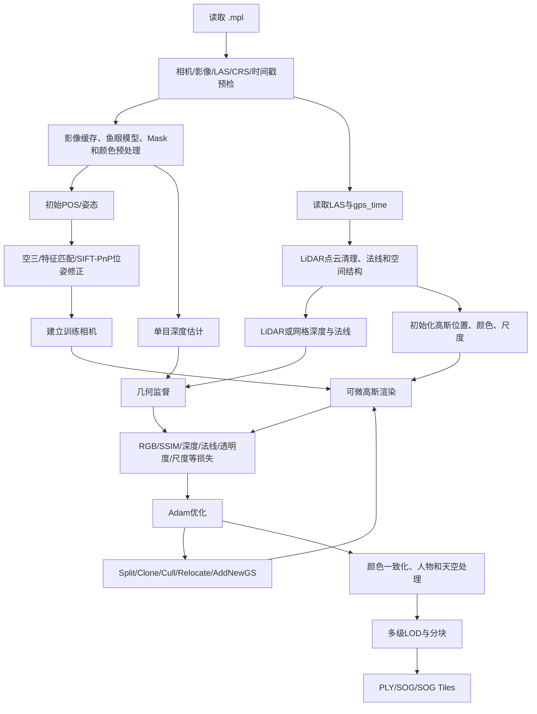

# MipMap Lite 激光雷达与 3D Gaussian Splatting 融合算法流程调研分析报告

## 1. 报告信息

- 调研日期：2026-08-21
- 调研对象：`D:\Program Files\MipMap\MipMapLite`
- 本机软件标识：`mipmap-lite 1.0.0`
- 目标数据：`G:\3dgs-datasets\2026-08-19_11-51-14-ff`
- 数据描述文件：`2026-08-19_11-51-14-ff.mpl`
- 对照项目：`G:\cloudstudio-3dgs`
- 报告性质：官方资料、安装包静态证据、真实数据核验与工程推断相结合的技术调研

## 2. 调研目的

本报告用于分析 MipMap Lite 如何将激光雷达点云、鱼眼图像、相机参数和图像位姿组织为一套完整的 3D Gaussian Splatting（下称 3DGS）重建流程，并回答以下问题：

1. MipMap 的 LiDAR + 3DGS 数据契约是什么。
2. 激光雷达在流程中只是初始化点，还是进一步参与深度、法线和几何约束。
3. MipMap 如何处理相机位姿、动态物体、颜色差异、天空和大场景输出。
4. MipMap 的训练流程与本项目现有 3000 步结果有什么本质区别。
5. 本项目应当如何吸收其工程思路，形成可控、可验证、可持续优化的自有方案。

本报告不尝试还原或复制 MipMap 的闭源实现代码，也不把二进制中无法确认的默认参数、训练步数和损失权重写成确定事实。

## 3. 证据等级与调研边界

为避免把推断误写成事实，本报告采用以下证据分级：

| 等级 | 定义 | 本报告中的典型来源 |
|---|---|---|
| A：官方确认 | 官方文档直接描述的数据字段、功能或输出 | MipMap Engine/Lite 官方文档 |
| B：本机直接证据 | 安装包文件、动态库导出符号、依赖、模型文件、前端业务逻辑和日志直接体现 | `mipmap_gaussian_splat.dll`、`mipmap_engine.dll`、Electron 资源、ONNX 文件 |
| C：真实数据实测 | 对目标 `.mpl`、影像路径和 LAS 内容进行只读解析得到 | 相机数、影像数、路径、时间范围、LAS 点数和 `gps_time` |
| D：工程推断 | 由 A/B/C 证据组合推导，但缺少闭源源码或成功动态任务证明 | 各模块的具体调用先后、损失权重、训练阶段切换条件 |

当前动态验证存在一个限制：本机 MipMap 工具服务启动日志报错 `Failed to get port from stdout`，因此尚未成功提交一项完整的 MipMap LiDAR 高斯任务。报告中的算法内部结构主要来自静态直接证据；准确的默认迭代次数、早停规则、损失权重和各阶段耗时仍需通过成功运行真实任务后补充。

## 4. 核心结论

MipMap Lite 的 LiDAR 3DGS 不是“把 LAS 转为高斯初始点，然后仅使用 RGB 训练”的简单流程，而是一套多阶段、几何约束较强的工程化重建管线：

1. 使用 `.mpl` 同时绑定相机模型、原始影像、逐图时间戳、POS/姿态、LAS 和坐标系。
2. 把影像时间戳与 LAS `gps_time` 的对应关系作为手持 LiDAR 数据的核心条件。
3. 使用 LiDAR 点云作为高斯空间结构和尺度的主要几何基础。
4. 存在 LiDAR/网格深度、网格法线和单目深度相关模块，说明几何信息不仅用于初始化，也可参与训练约束。
5. 存在 SIFT、`solvePnP`、`solvePnPRansac` 和相机位姿修正模块，用于缓解原始 POS/姿态误差。
6. 高斯训练包含颜色、SSIM、深度、法线、透明度、尺度、单视图和天空等多类损失接口。
7. 高斯数量和位置通过 Split、Clone、Cull、Relocate、AddNewGS、Opacity Reset 等机制动态调整。
8. 存在颜色一致化、双边网格、人物消除、天空/背景独立训练和多级 LOD。
9. 输出不局限于单个 PLY，还包括压缩 SOG 和适合大场景浏览的 SOG Tiles。

因此，MipMap 质量优势首先来自时空输入可靠、几何监督充分和训练流程完整，其次才是训练步数更多。单纯把本项目的 `max_steps` 从 3000 改到 30000，并不能自动复制其质量。

## 5. 软件组成与执行架构

### 5.1 桌面端与任务调度

MipMap Lite 是 Electron 桌面应用：

- 主程序：`D:\Program Files\MipMap\MipMapLite\MipMapLite.exe`
- Electron 包：`resources\app.asar`
- 应用版本：`1.0.0`
- 主进程代码经过字节码保护，界面资源和部分业务逻辑仍可读取。

前端负责：

- 创建 RGB 或 LiDAR 重建任务。
- 解析 `.mpl` 数据描述文件。
- 检查相机、影像 POS、时间戳和点云是否齐全。
- 选择模型、点云和高斯成果类型。
- 检查 Gaussian Splatting 与 Machine Learning 插件。
- 通过工具服务启动后台任务并接收流式进度。
- 加载 PLY、SOG Tiles 和天空高斯等成果。

### 5.2 工具服务

安装包包含：

`resources\resources\mipmap_engine_tool_service\mipmap_tool_service.exe`

其协议文件 `tool_service.proto` 定义了：

```text
MipMapToolService.RunTask(TaskRequest)
    -> stream TaskProgressEvent
    -> TaskResult
```

这表明桌面端与重建引擎之间不是直接在 UI 进程内调用，而是通过本地任务服务运行重建并流式返回进度、日志和最终状态。

### 5.3 主重建引擎

主要文件包括：

- `reconstruct_full_engine.exe`
- `divide_engine.exe`
- `mipmap_engine.dll`

`mipmap_engine.dll` 的可见符号体现了以下阶段：

- `ReconstructAT`
- `OptimizeAT`
- `SfMBlock`
- `MergeSfMBlock`
- `DepthEstimationTask`
- `DepthFilterTask`
- `Reconstruct3D`
- `ReconstructFull`
- `PostProcess3D`
- `DivideTiles`

这说明 MipMap 把空三/位姿、深度、三维重建、后处理和分块输出组织为统一管线。LiDAR 模式虽然拥有已知 POS 和点云，仍然可能复用其中的位姿优化、深度、网格和分块能力。

### 5.4 Gaussian Splatting 引擎

核心文件：

`D:\Program Files\MipMap\MipMapLite\resources\resources\catch3d\mipmap_gaussian_splat.dll`

该模块是约 38 MB 的原生 C++/CUDA 动态库，依赖包括：

- LibTorch 2.7.1 CUDA 12.8
- CUDA Runtime
- OpenCV 4.6
- Open3D
- NVIDIA NVML
- MipMap 分类/机器学习模块

从依赖和符号可判断，它不是调用外部 Python 训练脚本，而是在 MipMap 自有原生引擎中完成张量优化、可微渲染、高斯增密和成果输出。

### 5.5 机器学习模型

本机公共数据目录包含：

| 文件 | 大小 | 可能用途 |
|---|---:|---|
| `da2_v1.onx` | 391,390,944 字节 | 单目深度估计；文件名可能暗示 DA2 系列，但具体模型架构未确认 |
| `seg_model_v1.onx` | 141,733,488 字节 | 图像语义/人物等分割 |
| `seg_v1.onx` | 110,344,128 字节 | 图像分割或辅助掩膜 |
| `voc.bin` | 32,735,455 字节 | 视觉词袋或图像特征匹配辅助数据 |

二进制同时出现 `TensorRTMonoDepth`、`MonoDepthEstimate`、`GetMonoDepth` 等符号，因此“存在单目深度推理能力”属于 B 级直接证据；具体网络名称和使用范围仍需动态任务验证。

## 6. LiDAR `.mpl` 数据契约

### 6.1 官方要求

官方 LiDAR 数据规范规定 `.mpl` 本质上是 JSON 数据描述文件，核心内容包括：

- `coordinate_systems`：坐标系定义。
- `camera_meta_data`：相机模型、分辨率、内参和畸变。
- `image_meta_data`：影像路径、相机 ID、时间戳、位置、位置精度和可选姿态。
- `lidar_data`：LAS 文件列表、来源 ID 和坐标系 ID。

手持 LiDAR 场景的重要要求：

1. LAS 点必须在 `gps_time` 维度记录采集时间。
2. 每张影像必须有采集时间戳。
3. 影像时间戳必须能够和 LAS `gps_time` 匹配。
4. 影像 POS 必须与对应 LAS 使用相同坐标系。
5. `crs_id` 和 `source_id` 用于区分坐标系和不同采集源。
6. 鱼眼相机使用 `projection_model=1`，参数顺序为 `fx, fy, cx, cy, k1, k2, k3, k4`。
7. 鱼眼影像强烈建议提供世界到相机的 3×3 `orientation`。
8. 可以在相机级或影像级提供二值 Mask，0 值像素不参与重建。

### 6.2 前端启动前检查

MipMap Lite 的 LiDAR 任务界面会检查：

- 是否存在 LiDAR 文件。
- 是否存在图像 POS。
- 每个相机是否具有完整参数。
- 每张影像是否带时间戳。
- 影像和点云坐标系是否一致。

界面明确提示：

> 激光雷达参数不完整，请检查是否正确导入：点云、图像POS、相机参数、图像POS的时间戳。

以及：

> LAS点云和图像POS必须在同一个坐标系。

这进一步说明 MipMap 将数据完整性和时空一致性视为管线前置条件，而不是训练失败后再容错。

## 7. 目标数据实测结果

对以下文件进行了只读解析：

`G:\3dgs-datasets\2026-08-19_11-51-14-ff\2026-08-19_11-51-14-ff.mpl`

### 7.1 `.mpl` 结构

| 项目 | 实测结果 |
|---|---|
| 顶层字段 | `coordinate_system`、`camera_meta_data`、`image_meta_data`、`lidar_data`、`coordinate_systems` |
| 相机数量 | 2 |
| 相机名称 | `left`、`right` |
| 相机模型 | `projection_model=1`，鱼眼 |
| 相机分辨率 | 2912×2912 |
| 影像数量 | 666 |
| `camera` 原始影像 | 666 |
| `undistort` 影像 | 0 |
| 缺失影像引用 | 0 |
| 有时间戳的影像 | 666 |
| LAS 数量 | 1 |
| 缺失 LAS 引用 | 0 |

该文件符合“使用 `camera` 目录原始全景/鱼眼影像，不使用 108 张去畸变双目关键帧”的要求。

### 7.2 影像时间范围

```text
最小时间：1787165512.4278
最大时间：1787165678.43744
```

### 7.3 LAS 实测

`.mpl` 当前绑定：

`D:\S1\2026-08-19_11-51-14-ff\process\2026-08-19_11-51-14-ff\2026-08-19_11-51-14-ff_colorized.las`

| 项目 | 实测结果 |
|---|---|
| 点数 | 15,288,196 |
| LAS point format | 7 |
| `gps_time` | 存在 |
| 最小 `gps_time` | 1787165512.0905266 |
| 最大 `gps_time` | 1787165678.7909966 |

LAS 时间范围完整覆盖影像时间范围，因此具备按采集时间关联影像和 LiDAR 的基础。

### 7.4 路径可移植性风险

`.mpl` 文件存放在 `G:`，但内部影像和 LAS 使用 `D:\S1\...` 绝对路径。当前本机这些路径存在，因此本机校验通过；移动数据、复制到另一台电脑或改变盘符后，`.mpl` 将失效。

建议在正式管线中增加：

1. `.mpl` 导入前路径重定位。
2. 支持以 `.mpl` 所在目录为根的相对路径。
3. 通过采集 ID、左右相机目录和 LAS 文件名重新绑定。
4. 启动训练前输出缺失引用、时间覆盖率和 CRS 一致性报告。

## 8. 推断的完整算法流程



### 8.1 数据预检与分组

输入数据不是简单的影像目录，而是包含传感器语义的任务描述：

- 相机 ID 决定使用哪组鱼眼内参与畸变。
- `source_id` 决定影像与哪组 LAS/采集源关联。
- `crs_id` 决定位置数据采用哪个空间参考。
- 时间戳决定影像与扫描轨迹/点云采集时刻的对应关系。
- `pos_sigma` 表达位置先验可信度。
- `position_constant` 决定位置是否允许在优化中变化。

这一步的价值是把“数据是否可训练”转换为可验证的契约，避免错误相机模型、错位时间和错 CRS 被带入后续训练。

### 8.2 影像预处理

可确认的能力包括：

- 透视和鱼眼相机模型。
- 相机级 Mask 和逐图 Mask。
- 可选择是否保留去畸变图像。
- 图像缓存和金字塔/分辨率等级。
- 人物等动态区域分割。
- 颜色一致化和双边网格相关处理。

MipMap Lite 的 LiDAR 重建质量档：

| 档位 | 官方描述 |
|---|---|
| 超高 | 使用原图渲染 |
| 高 | 原图按 2 倍间隔重采样渲染 |

这与本项目现有 3000 步任务使用 4 倍缩图有明显差异。

### 8.3 位姿建立与修正

输入 `.mpl` 已提供逐图 POS，并可提供 `orientation`，但二进制仍包含：

- OpenCV SIFT 特征。
- `solvePnP`。
- `solvePnPRansac`。
- `projectPoints`。
- `RefineCameraPoseWithSIFT`。
- `ReconstructAT` 和 `OptimizeAT`。

据此可以确认 MipMap 具有基于图像特征和三维结构再次修正相机位姿的能力。合理推断的目的包括：

1. 修正轨迹插值和相机时间同步的小误差。
2. 修正 LiDAR 到相机外参残差。
3. 降低左右相机或相邻帧之间的接缝。
4. 为后续像素级 3DGS 损失提供更准确的投影关系。

具体是逐图触发、按块触发还是只在质量不足时触发，静态分析不能确定。

### 8.4 LiDAR 几何处理

高斯模块可见以下直接证据：

- `GaussianSplatModel` 可接收 `PointCloud`。
- 另一构造路线可同时接收现有 Gaussian 数据、PointCloud 和 Mesh。
- 使用 Open3D PointCloud 变换、包围盒和 `EstimateNormals`。
- 存在 `MeshRasterizerGPU`。
- 存在 `GetGTDepthFromMesh`。
- 存在 `ComputeGaussianNormals` 和 `ComputeNormalFromDepth`。

由此推断 LiDAR 至少承担以下作用：

1. **空间初始化**：高斯中心优先来自真实点云，而不是完全依赖 SfM 稀疏点。
2. **尺度初始化**：利用局部点间距或邻域结构初始化高斯尺度。
3. **场景边界**：确定有效三维范围、分块和裁剪区域。
4. **深度真值**：直接投影点云，或先建立 Mesh，再为相机生成深度监督。
5. **法线真值**：从点云邻域、网格或深度图估计表面法线。
6. **异常约束**：抑制远离真实表面的漂浮高斯。

需要注意：二进制能够接收这些数据不等于每个质量档都会启用所有损失。是否启用、权重多少、何时关闭仍属于未知闭源配置。

### 8.5 单目深度补充

直接证据包括：

- `TensorRTMonoDepth`。
- `WarmUp`、`InferRaw` 和 `MakeEngine`。
- `GetMonoDepth`。
- `Mono depth estimation completed. Cached ... depth maps`。
- 模型文件 `da2_v1.onx`。

LiDAR 投影通常在以下区域较稀疏：

- 远距离区域。
- 玻璃、反光和低反射区域。
- 点云扫描线之间。
- 天空和点云覆盖范围之外。

单目深度可以提供更连续的结构先验，但不能直接作为绝对尺度真值。合理的工程使用方式应当是：

1. 以 LiDAR 深度对单目深度做尺度和偏移对齐。
2. LiDAR 有效区域优先使用 LiDAR/网格深度。
3. 只在 LiDAR 稀疏或缺失区域使用单目深度补充。
4. 使用置信度、语义 Mask 和边缘 Mask 降低错误深度影响。

### 8.6 高斯初始化

可见接口包括：

- 从 PointCloud 初始化参数。
- 从已有 GaussianSplatData 初始化参数。
- `Initialize GS scene with scale`。
- 点云、网格和既有高斯混合输入路线。

合理推断的初始化属性包括：

- 均值：LiDAR 点坐标。
- 颜色或零阶球谐：彩色 LAS 或影像采样颜色。
- 尺度：局部 KNN 距离、点云密度或指定初始尺度。
- 旋转：单位旋转，或根据点云/网格法线初始化。
- 透明度：统一初值，后续通过训练和重置调整。

### 8.7 可微渲染

动态库包含经典可微高斯渲染相关 CUDA 内核：

- 高斯投影前向/反向。
- 光栅化前向/反向。
- 球谐颜色计算。
- KNN 和空间处理。
- MCMC relocation 内核。

整体训练仍遵循 3DGS 的核心闭环：

```text
选择训练相机
→ 投影三维高斯
→ 按深度和覆盖关系光栅化
→ 生成RGB/深度/法线等渲染结果
→ 与真实图像和几何先验计算损失
→ 反向传播
→ 更新高斯和可选相机参数
```

### 8.8 损失函数体系

二进制可见以下损失接口：

- `GetLoss`
- `GetLossWithGradientWeight`
- `GetDepthRegularizerLoss`
- `GetNormalLoss`
- `GetNormalGradientLoss`
- `GetOpacityLoss`
- `GetOpacityMeanRegularizerLoss`
- `GetScaleLoss`
- `GetScaleMeanLoss`
- `GetScaleRatioLoss`
- `GetSingleViewLoss`
- `GetSkyOpacityLoss`

可将其概念性表达为：

```text
Ltotal =
  λrgb · Lrgb
  + λssim · Lssim
  + λdepth · Ldepth
  + λnormal · Lnormal
  + λnormal-grad · Lnormal-gradient
  + λopacity · Lopacity
  + λscale · Lscale
  + λsingle-view · Lsingle-view
  + λsky · Lsky
```

该表达只用于说明损失组成，不代表 MipMap 的实际数学公式、默认权重或始终同时启用。

各类损失的可能目的：

| 损失 | 主要作用 |
|---|---|
| RGB/SSIM | 保持外观、纹理和局部结构 |
| 梯度加权 | 强调边缘和结构区域，减少纹理模糊 |
| 深度 | 把高斯限制在 LiDAR/网格表面附近 |
| 法线 | 稳定墙、地面和大型平面方向 |
| 法线梯度 | 保留物体边界和折角 |
| 透明度 | 清理低贡献、漂浮和冗余高斯 |
| 尺度/尺度比例 | 防止高斯过大、过扁或异常膨胀 |
| 单视图 | 抑制仅在一张图中成立的伪影 |
| 天空透明度 | 避免天空高斯污染前景几何 |

### 8.9 高斯增密、剔除和 MCMC

二进制存在：

- `SplitGS`
- `CloneGS`
- `CullGS`
- `CullGSRedundancy`
- `RelocateGS`
- `AddNewGS`
- `AfterTrainMCMC`
- Opacity Reset
- 优化器状态复制、删除、增加和重置

这表明其不是只做传统梯度阈值增密，而是组合使用：

1. **Split**：把覆盖范围过大、梯度较高的高斯拆分为更细高斯。
2. **Clone**：在高细节区域复制高斯以增加表达能力。
3. **Cull**：删除低透明度、异常尺度或无贡献高斯。
4. **Redundancy Cull**：删除空间与外观高度重复的高斯。
5. **Relocate**：将低价值高斯迁移到误差较大的区域。
6. **AddNewGS**：在缺失结构区域直接补充高斯。
7. **Opacity Reset**：防止早期错误透明度使高斯永久失去梯度。
8. **优化器状态维护**：高斯数量变化时同步 Adam 等优化器状态。

该机制有助于控制点数、提升细节并减少漂浮物。其具体阈值、频率和阶段窗口未公开。

### 8.10 颜色一致化

可见模块包括：

- `ApplyColorHarmonization`
- BilateralGrid
- 球谐颜色优化

双鱼眼或多相机数据通常存在曝光、白平衡和暗角差异。仅靠每个高斯的颜色学习，容易在相机切换和视场交界处形成接缝。颜色一致化与双边网格可以按影像或局部区域校正低频颜色差异，同时保留边缘。

### 8.11 人物和动态区域处理

MipMap Lite 官方界面提供“人物消除”，并说明该功能可消除镜头中人物对高斯成果的影响。安装包同时包含分割模型。

合理推断的处理方式包括：

1. 对人物区域生成语义 Mask。
2. 人物像素不进入静态场景 RGB 损失，或显著降低权重。
3. 对已经生成的人物高斯进行透明度削弱或剔除。
4. 防止人物在不同帧中形成拖影、重影和漂浮结构。

具体采用训练前 Mask、训练后清理还是二者组合，尚未通过动态任务确认。

### 8.12 天空与背景

可见证据包括：

- `TrainBackground`
- `GetSkyOpacityLoss`
- `sky.ply`
- `sky.sog`
- `sky.splat`

这表明 MipMap 可能把有限几何前景和远距离/无限背景分开处理。这样可以：

- 避免天空被错误压到有限深度。
- 减少天空对 LiDAR 几何损失的干扰。
- 提升室外大视场和鱼眼画面的稳定性。
- 在 Viewer 中分别控制场景主体和背景。

### 8.13 分块、层级和成果输出

可见训练/输出符号包括：

- `BatchTraning`
- `RunScaffold`
- `RunSimplified`
- `TrainLevel0`
- `CreateLevels`
- `CreateLoD`
- `CreateSogLOD`
- `Gaussian_Splatting_Level_...`
- `levels_info.json`
- `tileset.json`

官方支持的高斯输出包括：

- `generate_gs_ply`
- `generate_gs_sog`
- `generate_gs_splat_sog_tiles`

MipMap Lite 默认输出 SOG Tiles 与 PLY。Viewer 路线可加载：

- `result/3D/model-gs-ply/merged_gs.ply`
- `result/3D/model-gs-ply/sky.ply`
- `result/3D/model-gs-sog-tile/tiles.json`

这说明其最终目标不仅是生成一个训练 PLY，还包括大规模场景的层级组织、压缩和浏览器/桌面端流式加载。

## 9. MipMap 与本项目 3000 步训练对照

本项目阶段性结果目录：

`G:\cloudstudio-3dgs\results\2026-08-19_11-51-14-ff_imgpose_3k_df4`

### 9.1 本次训练事实

| 项目 | 实际配置/结果 |
|---|---|
| 输入影像 | `camera` 原始鱼眼图 |
| 有姿态影像 | 666 张 |
| 图像缩放 | 4 倍缩小，`data_factor=4` |
| 最大步数 | 3000，固定 `max_steps` |
| 停止方式 | 达到 3000 步停止，不是质量早停 |
| 位姿优化 | `pose_opt=true` |
| LiDAR | 1,019,218 个初始化点 |
| 深度损失 | `depth_loss=false` |
| 3DGS | 3DGUT + MCMC |
| MCMC 位置噪声 | `noise_injection_stop_iter=0`，关闭 |
| 高斯上限 | 1,100,000 |
| 后处理 | `post_processing=null` |
| 最终 PSNR | 15.7439 |
| 最终 SSIM | 0.4700 |
| 最终 LPIPS | 0.5698 |

根据结果文件时间，训练从约 16:01:48 开始，约 16:05:34 写完最终检查点，约 3 分 46 秒；最终验证约 16:05:52 完成，任务总时间约 4 分 04 秒。

该时间和指标说明它是一项快速流程验证，不是高质量正式训练。

### 9.2 差异表

| 环节 | MipMap 证据体现 | 本项目 3000 步任务 |
|---|---|---|
| 数据契约 | `.mpl` 明确相机、POS、时间、CRS、LAS | 使用转换后的 COLMAP 数据，时空契约未作为训练前统一门禁 |
| 鱼眼分辨率 | 原图或 2 倍重采样 | 4 倍缩图 |
| LiDAR 作用 | 初始化 + 点云/网格深度与法线能力 | 主要作为初始化点，`depth_loss=false` |
| 位姿 | 已知姿态 + SIFT/PnP/AT 优化能力 | 通用 `pose_opt`，没有证明使用 SIFT/PnP 与刚性双目约束 |
| 单目深度 | 存在 TensorRT 单目深度模块 | 未使用 |
| 法线监督 | 存在深度/高斯法线损失 | 未使用 |
| MCMC | Split/Clone/Cull/Relocate/Opacity Reset | 位置噪声关闭，较早达到 110 万高斯上限 |
| 动态人物 | 官方人物消除 + 分割模型 | 该次训练未启用人物 Mask/后处理 |
| 颜色 | 颜色一致化、双边网格 | 仅基础颜色/曝光路线，未形成等价闭环 |
| 天空 | 独立背景与天空输出 | 没有天空分支 |
| 训练阶段 | 存在 Level0、Scaffold、Batch、Simplified 和 CreateLevels | 单阶段 3000 步 |
| 输出 | PLY、SOG、SOG Tiles、LOD | 单个 PLY/checkpoint |

### 9.3 质量较差的主要原因

按影响优先级判断：

1. **训练目的不同**：3000 步配置用于证明原始鱼眼、3DGUT、MCMC 和 Windows CUDA 能跑通，不是最终质量配置。
2. **分辨率不足**：4 倍缩图显著损失远处纹理、树叶、帐篷边缘和地面细节。
3. **几何监督不足**：LiDAR 没有作为持续深度和法线监督。
4. **位姿误差仍会进入像素损失**：普通 pose optimizer 难以完全替代特征/PnP、刚性双目和 LiDAR 几何联合修正。
5. **MCMC 不完整**：位置噪声被关闭，限制了高斯从低价值区域向高误差区域重新分配。
6. **过早达到点数上限**：110 万高斯达到上限后，后续主要优化已有高斯，细节区域未必得到足够预算。
7. **人物未屏蔽**：不同帧中的人物位置变化会造成重影和漂浮高斯。
8. **无天空/背景分支**：鱼眼大视场中的天空和极远区域容易污染有限尺度几何。
9. **颜色和接缝处理不足**：左右鱼眼和相邻时刻的曝光差异会形成明显分区接缝。
10. **没有质量驱动停止**：只在第 3000 步验证，无法判断何时真正收敛。

## 10. 本项目可落地的升级方案

### 10.1 总体原则

建议借鉴 MipMap 的工程结构，但继续保留本项目自主、可解释、可测试的实现：

- `.mpl` 只作为数据互操作描述，不绑定厂商运行时。
- 保留原始鱼眼与 3DGUT 路线，不回退到 108 张去畸变关键帧。
- LiDAR 同时承担初始化、深度和法线约束。
- 双目相机必须共享刚性 Rig 约束，避免左右相机独立漂移。
- 动态人物、天空和无效鱼眼边缘必须进入统一 Mask 体系。
- 训练停止由固定上限和质量平台共同决定。
- 任何质量结论必须绑定固定验证集、配置、checkpoint 和场景哈希。

### 10.2 P0：数据契约与预检

目标：训练前证明输入可以可靠融合。

实施内容：

1. 新增 `.mpl` 直接读取或转换入口。
2. 自动重定位 `camera/left`、`camera/right` 和 LAS 路径。
3. 校验 666 张影像都来自 `camera`，拒绝误用 `undistort`。
4. 校验相机模型、分辨率、k1–k4、相机 ID 和图像尺寸一致。
5. 校验每张图像时间戳、POS 和姿态。
6. 校验 LAS point format、颜色、`gps_time` 和有效时间范围。
7. 计算影像时间覆盖率和 LAS 时间覆盖率。
8. 校验局部坐标、地理坐标和 ECEF 数据没有混用。
9. 输出机器可读 `input_acceptance_report.json`。

建议门禁：

- 缺失影像引用必须为 0。
- 缺失 LAS 引用必须为 0。
- 有时间戳影像比例必须为 100%。
- 影像时间必须落在 LAS `gps_time` 范围内。
- 鱼眼相机参数必须完整。
- 训练必须使用局部坐标系。

### 10.3 P1：进入本项目自有 Trainer

当前仓库已经具备或正在具备：

- raw-fisheye Dataset。
- 3DGUT 渲染。
- LiDAR ray-range 深度缓存和损失。
- 刚性 Rig 位姿优化结构。
- 人物 Mask 组合。
- MCMC 策略接口。
- checkpoint、固定 split 和质量报告。

下一次正式训练不应继续只使用上游 `simple_trainer.py` 的 3000 步配置，而应使用本项目自有 Trainer，把以下能力同时接入真实数据：

1. LiDAR ray-range 深度缓存。
2. 人物动态 Mask。
3. 双目 Rig 约束位姿优化。
4. 固定训练/验证 split。
5. 完整 checkpoint/resume。
6. 每阶段验证和质量报告。

### 10.4 P2：补齐完整 MCMC

需要修复 Windows gsplat 构建中缺失的基础协方差算子，恢复：

- MCMC 位置噪声注入。
- 完整 relocation。
- 正常 densification 窗口。
- 高斯增加/删除后的优化器状态维护。

验证不应只检查“训练未报错”，还应检查：

- 高斯数量在 refine 窗口中发生合理变化。
- relocation 计数非零。
- 没有 NaN/Inf。
- 点数上限不是在训练早期立即达到。
- 恢复训练后 MCMC 状态连续。

### 10.5 P3：LiDAR 深度与法线联合监督

建议建立两类几何目标：

1. **稀疏高置信 LiDAR ray-range**：直接由点云投影得到，保持绝对尺度。
2. **稠密网格深度/法线**：由局部点云构网或屏幕空间插值得到，补充连续表面。

训练时应：

- 使用遮挡感知 z-buffer。
- 只监督可见且置信度合格的 LiDAR 点。
- 在几何边缘降低插值深度权重。
- 对墙、地面等平面增加法线一致性。
- 对植被和稀疏边缘降低法线权重。
- 人物 Mask 同时作用于 RGB 和深度损失。

### 10.6 P4：单目深度补洞

单目深度不应取代 LiDAR，应作为补洞先验：

1. 离线为训练图生成单目深度与置信度。
2. 使用同帧 LiDAR 深度拟合单目深度的尺度和偏移。
3. LiDAR 有效像素使用 LiDAR；空洞区域才使用单目深度。
4. 天空、人物、反光和置信度低区域不使用单目深度。
5. 深度边缘使用图像梯度和 LiDAR 边缘联合保护。

### 10.7 P5：颜色、人物与天空

建议增加：

- 左右相机曝光/白平衡校正。
- 每图低频颜色校正或可学习双边网格。
- 人物分割与人工复核。
- 天空 Mask。
- 天空/远背景独立表达，或至少不参与 LiDAR 几何损失。
- 训练结束后的低透明度和大尺度漂浮高斯清理。

### 10.8 P6：LOD 与交付输出

在获得稳定高质量 PLY 后，再增加：

1. 空间分块。
2. 多级高斯简化。
3. 每块包围盒、误差和点数统计。
4. Viewer 按距离选择 LOD。
5. 可选 SOG/SPZ 或自有压缩格式。
6. 最终交付同时保留原始高质量 PLY 和浏览用瓦片成果。

## 11. 建议训练计划

以下是本项目建议配置，不是 MipMap 闭源默认参数。

| 阶段 | 建议步数 | 分辨率 | 主要目标 |
|---|---:|---|---|
| A：位姿与粗结构热身 | 0–2000 | 4 倍或 2 倍缩图 | 稳定位姿、尺度和低频颜色，暂缓激进增密 |
| B：几何主训练 | 2000–12000 | 2 倍缩图 | LiDAR 深度、法线、完整 MCMC、结构增密 |
| C：外观和细节 | 12000–25000 | 2 倍缩图 | RGB/SSIM、球谐、颜色一致化、人物 Mask |
| D：高分辨率精修 | 25000–30000 | 原图或重点 ROI | 边缘、细纹理、接缝和最终清理 |

如果显存或时间不足，应优先保证：

1. 2 倍缩图主训练。
2. LiDAR 深度和人物 Mask。
3. 完整 MCMC。
4. 固定验证集。

不建议再次以 4 倍缩图、无深度损失、关闭 MCMC 位置噪声的 3000 步结果作为质量结论。

## 12. 停止规则建议

### 12.1 MipMap 停止规则的已知与未知

静态二进制中可见：

- `iterations` 相关配置。
- `[Step] ... SSIM = ...` 日志。
- `Train step`。
- 多级训练与 Level 创建。

但没有足够证据确认：

- 默认总步数。
- 是否基于 SSIM 自动早停。
- 每个 Level 的步数。
- 是否按场景规模动态计算步数。
- 各质量档对应的确切训练计划。

因此不能声称 MipMap 使用某个确定步数或某项确定早停阈值。

### 12.2 本项目建议停止规则

建议采用“硬上限 + 质量平台 + 几何稳定”三重规则：

1. 硬上限：正式任务默认 30000 步。
2. 每 1000 步在固定验证集上计算 PSNR、SSIM、LPIPS。
3. 同时计算 LiDAR ray-range MAE/RMSE、有效监督像素数和边缘误差。
4. 连续 5 次验证中，如果 PSNR、SSIM、LPIPS 改善均低于预设阈值，可进入精修或停止。
5. 如果图像指标改善但 LiDAR 几何明显恶化，不允许停止并交付。
6. 如果接缝、人物拖影、漂浮高斯仍存在，即使数值平台也不能判定质量通过。

候选平台阈值可先设置为：

- PSNR 单次改善小于 0.05 dB。
- SSIM 单次改善小于 0.002。
- LPIPS 单次改善小于 0.003。

这些阈值需要通过本数据 10k、20k、30k 对比后再锁定，不能直接视为正式验收标准。

## 13. 验收方案

### 13.1 数据验收

- 666 张影像全部来自 `camera`。
- `undistort` 影像数量为 0。
- 相机参数和左右相机 ID 完整。
- 影像/LAS 时间范围覆盖通过。
- 所有路径存在或已成功重定位。
- 坐标系和单位检查通过。

### 13.2 训练验收

- 真实 raw-fisheye 3DGUT 前向和反向成功。
- 完整 MCMC 算子加载成功。
- 深度损失为正且有有效监督像素。
- 人物 Mask 对 RGB 和深度同时生效。
- Rig 优化保持左右相机外参刚性。
- checkpoint 恢复后数值和训练阶段连续。

### 13.3 质量验收

应固定当前 3000 步结果作为基线：

- PSNR：15.7439。
- SSIM：0.4700。
- LPIPS：0.5698。

新方案必须在同一验证集、同一图像缩放和同一评价代码上比较。第一阶段可采用相对门槛：

- PSNR、SSIM 明显高于当前基线。
- LPIPS 明显低于当前基线。
- LiDAR 深度误差不因追求图像指标而恶化。
- 左右鱼眼交界和轨迹分段接缝明显减少。
- 人物拖影和漂浮高斯明显减少。
- 墙、地面、帐篷边缘和树干不出现明显几何漂移。

最终验收必须包含固定相机路径视频、近距离、斜视角、地面附近和场景边缘视觉检查，不能只看训练损失。

## 14. 风险与待确认项

### 14.1 MipMap 闭源参数未知

以下内容目前不能确认：

- 默认训练步数和早停条件。
- 各类损失的公式与权重。
- LiDAR 点云是否始终先构 Mesh。
- 单目深度在哪些质量档启用。
- 人物消除发生在训练前、训练中还是训练后。
- SIFT/PnP 位姿修正的触发条件。
- SOG Tiles 的具体压缩和误差控制算法。

### 14.2 动态运行尚未完成

工具服务日志：

```text
Failed to get port from stdout
Failed to start tool service
```

建议后续先修复或绕过工具服务启动问题，再用同一 `.mpl` 提交一次真实任务，保存：

- 完整任务 JSON。
- 控制台和服务日志。
- 每阶段进度与耗时。
- GPU/显存曲线。
- 输出目录结构。
- PLY/SOG Tiles 点数和大小。
- MipMap 结果与本项目固定视角对照。

### 14.3 绝对路径风险

当前 `.mpl` 内部指向 `D:\S1\...`。一旦源数据只保留在 `G:\3dgs-datasets\...`，MipMap 导入会出现路径失效。正式自动化必须在提交任务前重写或重定位路径，并重新检查引用和时间范围。

### 14.4 不应直接复制闭源实现

本项目应借鉴公开数据契约和通用算法思想，独立实现并验证：

- LiDAR 深度/法线监督。
- 位姿修正。
- 单目深度补洞。
- MCMC 高斯管理。
- 颜色一致化。
- 人物和天空 Mask。
- LOD/分块。

不应复制或分发 MipMap 的闭源 DLL、模型文件或受保护前端代码。

## 15. 推荐实施顺序

建议按以下顺序推进：

1. 固化 `.mpl` 路径重定位和输入验收报告。
2. 用现有 666 张原始鱼眼图接入本项目自有 Trainer。
3. 启用已有 LiDAR ray-range、人物 Mask 和 Rig 位姿优化。
4. 修复完整 MCMC Windows CUDA 算子。
5. 完成 10k 步、2 倍缩图的第一轮真实 A/B。
6. 增加 LiDAR/网格法线监督。
7. 增加单目深度补洞与置信度控制。
8. 完成 20k–30k 粗到细正式训练。
9. 增加颜色一致化、天空分支和最终高斯清理。
10. 最后实现 LOD/分块浏览输出。

优先级上，时空对齐、LiDAR 深度、完整 MCMC、人物 Mask 和 2 倍/原图训练高于 SOG/LOD 输出。前者直接决定重建质量，后者主要决定交付与浏览性能。

## 16. 最终判断

MipMap Lite 的核心竞争力不是某一个神秘的 3DGS 公式，而是把以下能力组织成了完整产品管线：

- 严格的 LiDAR/影像/相机/时间/坐标数据契约。
- 已知 POS 与视觉特征结合的位姿优化。
- LiDAR 点云初始化、深度和法线几何约束。
- 单目深度补充。
- 多种外观与几何损失。
- 完整的高斯增密、剔除和 MCMC 迁移。
- 人物、颜色和天空处理。
- 多级 LOD 与 SOG Tiles 交付。

目标数据本身已经基本满足 MipMap LiDAR 重建输入要求，并且已经正确使用 666 张 `camera` 原始鱼眼图，没有引用 108 张 `undistort` 关键帧。当前质量差距主要来自本项目上一轮训练配置过于保守和流程不完整，而不是数据不能用于 3DGS。

下一阶段不应只是无条件延长 3000 步，而应先让 LiDAR 深度、人物 Mask、刚性位姿修正和完整 MCMC 真正进入训练，再进行 10k/20k/30k 的固定验证集对比。这样才能判断训练步数增加带来的是真实结构和画质提升，还是仅仅继续拟合错误位姿和动态内容。

## 17. 官方资料

1. MipMap Engine Overview：<https://docs.mipmap3d.com/engine/en/>
2. Full Pipeline Reconstruction：<https://docs.mipmap3d.com/engine/en/basic/reconstruct-full>
3. Advanced Parameters：<https://docs.mipmap3d.com/engine/en/basic/advanced-config>
4. LiDAR Reconstruction：<https://docs.mipmap3d.com/engine/en/advance/lidar>
5. LiDAR Data Specification：<https://docs.mipmap3d.com/engine/en/advance/lidar-data>
6. MipMap Lite LiDAR 重建设置：<https://docs.mipmap3d.com/lite/zh-Hans/4.Lidar/ReconstructionSeting>

## 18. 本机证据路径

1. `D:\Program Files\MipMap\MipMapLite\MipMapLite.exe`
2. `D:\Program Files\MipMap\MipMapLite\resources\app.asar`
3. `D:\Program Files\MipMap\MipMapLite\resources\resources\catch3d\reconstruct_full_engine.exe`
4. `D:\Program Files\MipMap\MipMapLite\resources\resources\catch3d\divide_engine.exe`
5. `D:\Program Files\MipMap\MipMapLite\resources\resources\catch3d\mipmap_engine.dll`
6. `D:\Program Files\MipMap\MipMapLite\resources\resources\catch3d\mipmap_gaussian_splat.dll`
7. `D:\Program Files\MipMap\MipMapLite\resources\resources\catch3d\mipmap_classify.dll`
8. `D:\Program Files\MipMap\MipMapLite\resources\resources\tool_service.proto`
9. `C:\ProgramData\MipMap\MipMapLite\gdal_data\da2_v1.onx`
10. `C:\ProgramData\MipMap\MipMapLite\gdal_data\seg_model_v1.onx`
11. `C:\ProgramData\MipMap\MipMapLite\gdal_data\seg_v1.onx`
12. `%APPDATA%\mipmap-lite\logs\2026-8-21@1.0.0.log`

## 19. 本项目对照证据

1. `G:\cloudstudio-3dgs\results\2026-08-19_11-51-14-ff_imgpose_3k_df4\cfg.yml`
2. `G:\cloudstudio-3dgs\results\2026-08-19_11-51-14-ff_imgpose_3k_df4\stats\val_step2999.json`
3. `G:\cloudstudio-3dgs\docs\2026-08-20_全量原始鱼眼3DGS训练记录.zh-CN.md`
4. `G:\cloudstudio-3dgs\cloudstudio_3dgs\training\trainer.py`
5. `G:\cloudstudio-3dgs\cloudstudio_3dgs\training\backend.py`
6. `G:\cloudstudio-3dgs\cloudstudio_3dgs\data\depth_cache.py`
7. `G:\cloudstudio-3dgs\cloudstudio_3dgs\training\rig_pose.py`
8. `G:\cloudstudio-3dgs\cloudstudio_3dgs\data\person_masks.py`
