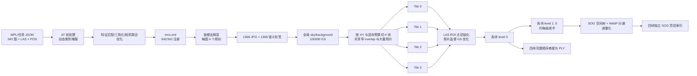

# snow-20260827 MipMap LiDAR Gaussian Splatting 最终研究报告

审计日期：2026-08-27
当前任务：`D:\mipmap-lite\1fad9647-f717-4cd4-9391-11f219d7e5d1\snow\snow-20260827`
任务 ID：`6032cb3c-d0cd-470c-a057-8ace47fe4e10`
软件：MipMap Lite 1.0.0 / SDK 5.1.0.8
运行终态：`complete`
运行时间：2026-08-27 12:11:21 至 13:54:36（UTC+08:00）
审计方式：实时只读监控、终态文件解析、静态二进制能力检查和确定性抽样；未修改、停止、附加调试或转储 MipMap 进程，未修改客户输入数据。

范围说明：本报告只把 12:11:21 新建的 `snow\snow-20260827` 作为成功运行。实时研究流水账开头约 1～220 行记录的是凌晨中断的旧 `snow2\snow2-20260827`；旧任务最终为 error、没有完整 Tile/PLY，不参与本报告的终态数量和质量统计。

## 1. 一句话结论

这次任务实际执行的不是“把 LiDAR 点统一缩减成固定比例的 Gaussian”，而是：

> **以原始 LAS 的分块 ROI 点作为几何种子，在每块的相机观测和显存预算内独立优化 Gaussian 的数量、位置、尺度、方向、颜色和透明度；训练后为每块建立约二分的六级 LOD，最终 PLY 将四块完整 level-0 原样顺序串接，SOG 则保留四个独立块树。**

最重要的定量结果是：

- 四块的 `N_GS/N_LAS` 分别为 **65.66% / 130.76% / 83.59% / 61.43%**，排除了固定比例下采样。
- Tile 输入 PNTS 与原始 LAS ROI 点数逐块相等或只差 2～4 点，排除了“先生成一套 MVS 稠密点云再作为主体初始化”的解释。
- Gaussian 最短轴与 LAS 局部法向高度一致，但 mean 普遍有厘米级法向位移；因此 LiDAR 是强几何先验，不是不可移动的最终表面。
- 相邻块独立训练后，在共享 LAS anchor 上对 20～50 mm 法向修正的方向具有明显复现性。这支持 **photo-guided、具有确定性成分的表面修正**，不支持把主要位移解释成纯随机漂移。
- 在 4,235 个稳定 0.5 m voxel 上，局部 `N_GS/N_LAS` 与图像梯度、局部熵呈稳定正相关；而视图数量本身的相关性很弱。高纹理/高信息区域确实得到更多 GS，但 mean 大位移主要与远距离、低覆盖、LAS 稀疏和曲率相关。
- 本次产物没有执行“overlap 裁成互斥 core 后再合并”：最终 PLY 数量精确等于四块完整 level-0 之和，参数也逐段逐字段相等。`Cut`/`SaveROI` 虽存在于 DLL 能力中，但没有在这条输出路径上留下实际调用结果。
- 软件没有保存训练中 checkpoint，因此 clone、split、cull、opacity reset、MCMC relocation 的具体发生时刻和 schedule **仍不可从终态净数量反演**。

## 2. 证据等级

本文严格区分三类结论：

| 等级 | 含义 | 例子 |
| --- | --- | --- |
| 直接证据 | 当前任务的文件、明文日志、时间戳、格式或数值能够直接验证 | 342/342 注册、四块 PB 数量、最终 PLY 串接顺序 |
| 静态能力证据 | 安装 DLL/模型确实实现了该接口，但不自动证明本任务调用 | `CloneGS`、`RelocateGS`、`GetDepthRegularizerLoss` |
| 推断 | 多项直接证据共同支持，但缺少调用日志、配置权重或中间状态 | 视觉损失驱动 mean 修正、DA2 深度可能参与正则 |

凡是只有静态符号而无运行产物的算法，本文不会写成“已确认执行”。

## 3. 输入与前置故障闭环

### 3.1 旧错误不是时间同步问题

旧任务的 `Photo reading error` 已定位为 `.mpl` 中的绝对路径失效：原路径缺少 `S1/USA`，导致 342 张照片和 LAS 都不可读。修正版 MPL 只改了 343 处根路径，原文件未覆盖。本次任务能够读取 342 张照片、完成 AT 并生成最终产品，构成了“修正版可被 MipMap 实际识别”的运行级验证。

### 3.2 本次有效输入

| 项目 | 实测值 |
| --- | --- |
| 相机 | 2 个鱼眼相机 |
| 照片 | 左 171 + 右 171 = 342，全部带定位 |
| 原始照片尺寸 | 2912×2912 |
| LAS | LAS 1.4 / Point Format 7 |
| LAS 点数 | 7,036,347 |
| LAS GPS time | 7,036,347 点全部有限且非零 |
| 输出开关 | `gs_ply`、`gs_sog_tiles` |
| 人物/移动物体移除 | `remove_moving_object=true` |
| 坐标语义 | `MVP S1 Local` |

其余实际持久化参数包括：Standalone、`keep_undistort_images=false`、`resumable_reconstruction=true`、`lidar_mesh_fineness=0.05`、`mesh_decimate_ratio=1`。普通 LAS/点云、mesh、OBJ/OSGB/FBX/GLB 等输出均未启用。最终报告记录 `block_count=4`、`removed_image_count=0`、`scene_area=627.369202`、`scene_gsd=0.002862`；`removed_image_count=0` 只说明没有整张照片被移除，不代表动态像素没有被 mask。

任务照片时间范围为 `1771971715.89177–1771971800.89706`；LAS GPS time 为 `1771971715.5415368–1771971801.5404040`，前后完整包围照片范围。照片目录实际每侧各有 176 张，但任务只使用了有姿态且处于有效覆盖段的 171+171 张。

输入内部相对时间轴已通过此前专项审计：LAS、双目照片和 `odom.csv` 共用约 `17719717xx` 的传感器/GPS 时间；双目同帧时间差中位数 0.004096 ms、最大 0.068864 ms；照片相对轨迹的内容级偏移扫描以 0 ms 最佳。设备/MCAP 记录时间与 GPS 时间仍相差约 71.21 天，这是绝对时基异常，但没有破坏本次内部融合。

### 3.3 质量档位没有按用户意图切换

本轮用户希望选择 `High`，但最终 `info.json`、`task.json` 和四个块任务持久化的都是 `resolution_level=1`。安装界面代码把 1 映射为 `Ultra High`、2 映射为 `High`、3 映射为 `Medium`；SDK 日志却把 1 文本打印为 `high (1)`。

因此本次实际仍是 **UI 语义下的 Ultra High**，与旧任务没有形成 High/Ultra High 对照。任何速度、显存或质量差异都不能归因于用户所尝试的档位切换。

## 4. 实际流水线总览

## 5. 精确时间线与耗时

| 时间 | 阶段/事件 | 直接证据 |
| --- | --- | --- |
| 12:11:21 | 新任务创建并启动 | `info.json.started_at` |
| 12:11:29 | AT 引擎开始 | `--reconstruct_type 1`、明文 `Start AT` |
| 12:11:50～12:12:11 | 生成 342 个动态类别掩膜 | `milestones/classify/*.tif` |
| 12:12:22 前后 | 形成图像匹配列表 | `match_list_0.pb.bin`（实时阶段捕获，终态已清理） |
| 12:14:23 | SfM 块完成 | `mvs_block_0.pb.bin` |
| 12:14:26 | AT 完成 | `mvs.xml`、报告与 100% 日志 |
| 12:14:27 | 同一任务进入 3D 引擎 | PID 7204，`--reconstruct_type 2` |
| 12:21:34～12:24:25 | 鱼眼展开与语义分割 | 运行时捕获 1,368 对 JPG/TIF |
| 12:24:26 | 去畸变完成 | `mvs_undistort.xml`、完成标记 |
| 12:28:52 | 全局背景 Gaussian 完成 | background PB、`sky.ply` |
| 12:28:53 | 四块任务确定 | `task/tiles.json`、4 个 block MVS |
| 12:29:21～12:59:38 | Tile_0 点云、训练、LOD、SOG | 块报告 30.750000 min |
| 13:00:01～13:22:46 | Tile_1 | 23.116667 min |
| 13:23:41～13:42:18 | Tile_2 | 19.516667 min |
| 13:42:30～13:54:19 | Tile_3 | 12.000000 min |
| 13:54:23 | 紧凑 PLY 写完 | `model-gs-ply/gs.ply` |
| 13:54:29 | UE PLY、SOG 顶层索引、`rec.done` | 文件时间戳 |
| 13:54:31 | 3D 日志 100% | `3D Reconstruction Finished` |
| 13:54:36 | 任务终态更新 | `status=complete` |

报告口径的 AT 为 2.65 min、3D 为 99.90 min；四块重建报告合计 85.383 min，占 3D 时间约 85.47%。其余约 14.52 min 用于去畸变、语义推理、背景、切块和最终汇总。任务从创建到终态的墙钟时间为 103 min 15 s。

## 6. 每一步具体做了什么

### 6.1 任务解析与资产预检

软件把 MPL 的相机、影像、POS、LAS 和输出选择固化到 `task.json`、`at_task.json`、`r3d_task.json`。本次路径全部可读，因而没有复现旧任务的输入读取错误。MipMap 本身仍缺少足够早的“所有路径不存在就阻断”提示；这属于产品预检缺口，不是训练算法错误。

### 6.2 AT：联合定向，而不是直接开始 GS

直接结果：

- 342/342 图像注册，移除 0 张；
- 重投影 RMSE 1.251524 px；
- tie point 18,931；
- POS RMS：X 0.018780 m、Y 0.015438 m、Z 0.006826 m；
- 每张照片的 AT 位置修正范数 p50/p90/p95/max 为 20.91/37.68/45.33/54.43 mm；三轴均值接近 0，说明主要是局部联合调整，不是整体平移。

`report.json` 还保留了优化前后的 342 图三角化统计：feature 总数约 786,409 → 785,891，track 总数保持 772,305；per-image reprojection RMSE 中位数由 14.47 px 降到 3.33 px、p90 由 19.57 px 降到 3.99 px。最终全局 `residual_rmse=1.251524 px` 与 per-image 表的统计口径不同，不能直接相减，但两者共同证明联合优化确实改变了相机/轨迹解。

实际文件时序证明 AT 包含动态类别掩膜、图像对候选/匹配、相机与照片块交换、三角化统计和相机联合优化。安装二进制出现 ORB、PnP、g2o 等能力字符串，但现有明文日志没有给出本任务的确切特征检测器、匹配器或 BA 求解器配置，因此只能确认功能阶段，不能把某个具体 detector 写成已调用事实。

### 6.3 鱼眼展开和语义处理

342 张源图最终生成 1,368 个去畸变视图，精确为每张 4 个方向。运行时文件为 1456×2912 JPG；对应标签为 364×728 Gray8 TIF，抽样出现 0、1、2、3、4、6、7、34 等多个离散类别，不是单一人物二值 mask。

保留的 `mvs_undistort.xml` 有 8 个 Photogroup、每组 171 张；其中四组为 1456×2912、四组为 2912×1456，共记录 1,368 Photo、16,216 TiePoint 和 125,690 Measurement。这进一步证明四向展开同时包含横向与纵向 face，而不是简单复制或缩放原图。

运行进程加载 `mipmap_classify.dll`、TensorRT、ONNX parser；DLL 暴露 `SegFormerSeg`、`TensorRTSeg`。`seg_v1...ege` 于 12:21:24 生成，且 JPG/TIF 一一落盘，因此 **TensorRT 语义分割属于已确认执行**。标签在终态临时目录清理前被用于 `remove_moving_object=true` 流程；保留的 342 个初始分类 TIF 共 4.65 MB。

### 6.4 单目深度的证据边界

`mipmap_classify.dll` 和 GS DLL 都含 `TensorRTMonoDepth`/`GetMonoDepth`，模型目录有 `da2_v1.onx`。针对 RTX 5070 的 `da2_v1...ege` 恰在 Tile_0 活跃训练期间 12:31:58 生成，这强烈支持程序至少构建并初始化了 DA2 单目深度 TensorRT 引擎。

但成功终态没有保留逐图 depth 文件，任务 JSON 也没有公开 depth loss 权重。故当前最严谨表述是：**单目深度推理链很可能被启动，是否以及以多大权重进入最终 GS 深度/法向正则仍未直接证实。**

### 6.5 全局背景/天空

主体分块前先生成一次全局背景：

- `gaussian_splat_background.pb.bin`：100,000 GS；
- `sky.ply`：100,000 vertex，5,600,362 B；
- `sky_full.ply`：同一批背景 GS 的扩展属性版。

这与 DLL 的 `TrainBackground` 和 `GetSkyOpacityLoss` 能力相符。背景没有追加到主 `gs.ply`；主模型和 sky 是独立文件。

### 6.6 怎么分块

本次为共享完整 Z 范围的二维 XY 矩形切分，不是三维八叉树训练块：

| Tile | XY ROI（局部坐标） | 估算最大显存 | 派生训练视图 |
| --- | --- | ---: | ---: |
| 0 左下 | X `[-54.389, 0.251]`，Y `[-53.264, 3.356]` | 6.591 GB | 656 |
| 1 左上 | X `[-54.389, 0.251]`，Y `[3.152, 48.792]` | 6.042 GB | 644 |
| 2 右下 | X `[0.018, 62.281]`，Y `[-53.257, -0.388]` | 5.082 GB | 607 |
| 3 右上 | X `[0.018, 62.281]`，Y `[-0.591, 48.800]` | 4.264 GB | 595 |

共同 Z 为 `[-14.621, 22.146]`，共同坐标 offset 为 `[2.767021, -4.222885, 1.415041]`。左右列重叠约 23.287 cm；上下块重叠约 20.371 cm。左右列的 Y 切线不同，加上每块不同的显存估算，支持“按内容/负载递归平衡”的判断，而不是固定方格；`divide_mode=2` 没有公开正式算法名，不能直接命名为 KD-tree。

照片不是互斥分配：四块仅覆盖 1,254 个不同派生视图，但成员合计 2,502；相邻块共享 282～417 个视图，对角块也共享 196～217 个。高共享率使 overlap 两侧从相同照片监督中独立学习。

### 6.7 每块输入点云怎么来

每块先从原始 LAS 按 `ROI + offset` 取点，再写私有 point-cloud PB 和层级 PNTS。标准 PNTS 的 `POINTS_LENGTH` 与 LAS ROI 的只读计数如下：

| Tile | PNTS 点数 | LAS ROI 点数 | 差值 |
| --- | ---: | ---: | ---: |
| 0 | 2,700,801 | 2,700,799 | +2 |
| 1 | 1,520,716 | 1,520,716 | 0 |
| 2 | 1,802,271 | 1,802,271 | 0 |
| 3 | 1,221,675 | 1,221,671 | +4 |

2～4 点差仅为 0.0001% 量级，符合边界包含、浮点/量化差异。四块重复证明：**主体初始化点云是 LAS ROI 子集，没有可见的 MVS/depth 点数扩充。**

### 6.8 Gaussian 初始化与训练

PB 结构和终态参数证明每个 Gaussian 至少包含：mean xyz、三轴 log-scale、DC/SH0 颜色、opacity logit、wxyz 四元数。初始化函数的静态能力为 `InitialParameters(PointCloud)`；结合输入点数的一致性和 orientation 审计，最合理模型是：LAS 提供初始 mean/颜色及局部尺度/法向先验，然后进入照片监督优化。

本任务实际加载了 PyTorch/CUDA/cuBLAS/cuDNN，GPU 长时间活跃，并逐块写出新的 mean、scale、orientation 和 opacity。GS DLL 的编译能力进一步显示：

- 投影/渲染：`ProjectGaussians`、`RasterizeGaussians`、`PlaneRasterizeGaussians`、`SphericalHarmonics`；
- 优化器：`InitialOptimizer`、`OptimizersStep`、`UpdateLearningRate`，并包含 Adam；
- 损失接口：单视图重建、SSIM、depth regularizer、normal、normal-gradient、opacity、scale、scale-ratio、sky-opacity；
- 生命周期：`CloneGS`、`SplitGS`、`CullGS`、`CullGSRedundancy`、`Reset Opacity`、`RelocateGS`、`AfterTrainMCMC`；
- 辅助：`ShrinkBigScaleGS`、`RefineCameraPoseWithSIFT`、`ApplyColorHarmonization`。

这里的关键边界是：渲染、反向优化和每块最终数量变化有运行证据；但具体 loss 权重、densification 阈值、迭代次数、clone/split/cull 次数、MCMC 是否启用，仅凭 DLL 符号不能确定。

### 6.9 四块是顺序训练，不是并行训练

整个 3D 阶段只有一个 PID 7204。点云、level-0、LOD、SOG 和 `.done` 严格按 Tile_0 → Tile_1 → Tile_2 → Tile_3 出现。每块完成并释放/切换资源后才开始下一块。这是 Standalone 模式下的单 GPU 串行调度。

## 7. 四块 Gaussian 生命周期的终态结果

| Tile | 输入 PNTS | level-0 GS | 净变化 | `GS/input` | 块时间 |
| --- | ---: | ---: | ---: | ---: | ---: |
| 0 | 2,700,801 | 1,773,436 | -927,365 | 65.6633% | 30.750 min |
| 1 | 1,520,716 | 1,988,450 | +467,734 | 130.7575% | 23.117 min |
| 2 | 1,802,271 | 1,506,518 | -295,753 | 83.5900% | 19.517 min |
| 3 | 1,221,675 | 750,498 | -471,177 | 61.4319% | 12.000 min |

这张表否定了“全局固定保留 0.8× LiDAR”之类的规则。Tile_1 在同一配置下净增 30.76%，Tile_3 却净减 38.57%。终态只能证明每块经历了不同的净重分配，不能仅凭净值把内部事件拆成 grow 和 cull。

四块 level-0 合计 **6,018,902 GS**。四个 PNTS 合计 7,245,463 点，其中包含 overlap 的重复输入；原始 LAS 只有 7,036,347 点。最终 PLY也保留 overlap 的双份结果，因此不能把 `6,018,902 / 7,036,347` 简化成一个无重叠的全局保留率。

## 8. Gaussian 参数与表面结构

### 8.1 最终主 PLY 的整体分布

对全部 6,018,902 个 Gaussian 解码 `exp(log-scale)` 与 `sigmoid(opacity)`：

| 指标 | p10 | p50 | p90 | p95 | p99 |
| --- | ---: | ---: | ---: | ---: | ---: |
| 短轴 mm | 0.166 | 0.767 | 4.643 | 8.809 | 24.297 |
| 中轴 mm | 0.526 | 1.990 | 14.572 | 28.350 | 73.051 |
| 长轴 mm | 2.193 | 10.465 | 59.337 | 89.649 | 209.596 |
| 长短轴比 | 3.584 | 12.544 | 52.615 | 80.481 | 183.478 |
| opacity | 0.0596 | 0.1148 | 0.3514 | 0.5105 | 0.8568 |

`opacity < 0.05` 为 0，说明最终文件中没有这一阈值下的 dead GS；可能是 cull 后结果或参数下限，二者无法仅从终态区分。模型是高度各向异性的薄椭球，不是球形点精灵。

### 8.2 四块尺度差异

Tile_1 的短轴中位数最小（0.403 mm）、aspect 中位数最高（16.27）；Tile_3 的短轴中位数 1.304 mm、长轴中位数 17.719 mm。各块不仅数量不同，Gaussian 形状自由度和薄片化程度也不同。这符合“每块按照片可解释性和局部几何重新分配表示能力”。

### 8.3 最短轴仍受 LiDAR normal 强约束

统一方法：每块从 level-0 等间隔抽 100,000 GS；查询最近 LAS anchor，用 24 邻点 PCA；可靠条件为 `λ0/sum(λ)<0.02` 且 `λ1/λ2>0.1`。四元数按 wxyz 解码后：

| Tile | 可靠邻域 | 最短轴/normal 中位角 | ≤15° | ≤30° |
| --- | ---: | ---: | ---: | ---: |
| 0 | 80.49% | 9.19° | 71.84% | 89.66% |
| 1 | 92.90% | 8.85° | 72.05% | 88.60% |
| 2 | 77.26% | 10.76° | 64.09% | 84.44% |
| 3 | 70.65% | 9.90° | 67.03% | 85.28% |

Tile_3 若按 xyzw 解码，中位角恶化到 35.49°；这与其他块一起支持文件四元数顺序为 wxyz。结论不是“mean 锁死在 LiDAR 点”，而是 **orientation 保留强 LiDAR 表面先验，mean 可以被照片目标明显移动。**

## 9. Gaussian mean 相对 LAS 表面的位移

### 9.1 不是单纯沿切平面重采样

| Tile | 可靠法向位移 p50 | p90 | p95 | 最近点≥20 mm但法向<5 mm |
| --- | ---: | ---: | ---: | ---: |
| 0 | 12.07 mm | 32.22 mm | 48.14 mm | 1.24% |
| 1 | 10.83 mm | 36.04 mm | 53.93 mm | 2.61% |
| 2 | 14.19 mm | 50.12 mm | 99.29 mm | 1.95% |
| 3 | 14.31 mm | 75.05 mm | 151.70 mm | 1.84% |

此前假设“虽然最近 LAS 点很远，但 95% 仍贴在 LAS 局部平面几毫米内”被四块数据否定。大量 mean 具有真正的法向厘米级修正，不只是沿表面自由重采样。

### 9.2 右侧 Tile_2/3 有显著长尾

Tile_3 最近 LAS 距离 p10/p50/p90/p95/p99 为 5.521/17.189/152.256/614.897/2784.268 mm，44.765% ≥20 mm、12.084% ≥100 mm。Tile_2/3 距 LAS ≥500 mm 的比例分别为 5.817%/5.632%，而 Tile_0/1 仅 0.970%/0.618%。

这些长尾点并非简单从 halo 漏出：Tile_2/3 的 ≥500 mm 点离块 XY 边界中位数分别为 14.23/11.37 m，且只有约 0.29%/0.30% 仍处于同一个 0.5 m LAS 占据 voxel。其 opacity 中位数约 0.103/0.097，长轴中位数约 91.7/104.8 mm，也不是一批透明度接近零、即将被删掉的无意义点。

最符合证据的解释是：右侧两块存在照片可见但 LAS 稀疏/缺失的视觉补面，或低约束区域的 GS 漂移；没有 checkpoint 时，不能再细分成渐进 mean move、split 子点扩张或 MCMC relocation。

## 10. 局部密度到底由什么驱动

### 10.1 `N_GS/N_LAS` 高度非均匀

Tile_0 的 0.5 m 共享 voxel 比率 p50/p90 为 0.386/3.000；Tile_1 为 0.941/7.307；Tile_3 为 0.660/7.550。加入 `N_LAS≥100` 稳定分母后，Tile_3 的 p50/p90 降为 0.313/1.033，说明裸高分位很大一部分受低 LAS 分母放大，但稳定区域仍存在真实密度重分配。

Tile_3 有 10.53% 的 GS 落入无 LAS 的 0.5 m voxel；1 m 口径仍为 8.09%。这与其远离 LAS 的长尾一致。

### 10.2 图像回归方法与投影校验

终态后对四块全部稳定 0.5 m voxel（`N_LAS≥100`）做受控图像审计，共 4,235 格，Tile_0～3 分别为 1,515/716/1,004/1,000。342/342 张优化后原始鱼眼图均可读。

由于 MipMap 已按 `keep_undistort_images=false` 清理临时去畸变 JPG，分析没有伪装这些文件仍存在，而是依据 `mvs_undistort.xml` 的原生 face 像素网格，把每个 11×11 局部 patch 反向映射到 AT 优化后的原始鱼眼图。KB4 鱼眼投影以 10,000 个 AT measurement 验证，重投影误差 p50/p90 为 0.816/1.676 px，与 AT 观测残差量级相符。

按 source image 去重后，共得到 683,986 条 frustum proxy 观测、538,538 条 Near/Far depth-gated 观测和 535,027 条 mask 有效深度观测。全部 4,235 个 voxel 至少有 3 张有效图像观测；2,917 个 voxel 另有不少于 5 个可靠 GS 法向位移样本。visibility 没有 z-buffer 或网格遮挡测试，因此仍称 proxy，不能写成真实可见性。

### 10.3 什么驱动局部 Gaussian 密度

为同时控制四个 Tile 本身的密度基线，报告 pooled Spearman 和 Tile 内 rank 后再合并的相关性：

| 自变量 | density pooled `ρ` | within-Tile rank `ρ` | 解释 |
| --- | ---: | ---: | --- |
| 图像 gradient 中位数 | 0.364 | **0.380** | 稳定中等正相关 |
| 图像 entropy 中位数 | 0.369 | **0.392** | 稳定中等正相关 |
| 有效 depth view 数 | 0.040 | 0.079 | 很弱 |
| 相机距离 | -0.157 | -0.140 | 弱负相关 |
| LAS voxel covariance curvature | 0.170 | 0.198 | 弱正相关 |

四块各自的 gradient 相关为 0.515/0.333/0.409/0.199，entropy 为 0.502/0.337/0.428/0.200；符号四块一致。gradient 从低到高五分箱时，`N_GS/N_LAS` 中位数为 **0.169 → 0.321 → 0.496 → 0.554 → 0.653**；entropy 分箱为 **0.177 → 0.321 → 0.458 → 0.523 → 0.684**。

这直接支持：**在稳定 LAS 分母下，高纹理/高信息区域获得更多 Gaussian。** 数据不支持“只要看到该 voxel 的相机越多，就简单分配更多 GS”。

稳健性对照不使用 Near/Far 门控、只保留 frustum+mask 时，density vs gradient/entropy 仍为 `ρ=0.329/0.343`；depth-gated 口径为 0.364/0.369。纹理—密度正相关不是 Near/Far 门控单独制造的。

### 10.4 什么驱动 mean 法向位移

对 2,917 个具有稳定图像与 GS 支持的 voxel：

| 自变量 | normal displacement pooled `ρ` | within-Tile rank `ρ` |
| --- | ---: | ---: |
| gradient | 0.136 | 0.136 |
| entropy | 0.139 | 0.134 |
| depth-gated view count | -0.423 | -0.455 |
| frustum view count | -0.467 | -0.512 |
| camera distance | **0.498** | **0.494** |
| `N_LAS` | -0.284 | -0.303 |
| curvature | 0.169 | 0.178 |

相机距离五分箱的法向位移中位数为 **11.37 → 13.06 → 15.28 → 24.53 → 34.19 mm**；view count 五分箱则从 **25.11 → 20.38 → 17.39 → 16.09 → 10.44 mm** 单调下降。

因此 mean 大位移更强地关联 **远距离、低视角覆盖、较低 LAS 支持和复杂几何**；图像梯度/熵只有弱正效应。更合理的解释是低约束区域的不确定性与表面修正增大，而不是“高纹理直接把 Gaussian 沿法向推得更远”。

跨视图亮度 MAD 只能作为强度离散代理：它与 density 的 pooled/within 相关为 0.313/0.227，但 Tile_2 为 -0.10；与位移为 -0.089/-0.080。它不是软件的 per-pixel photometric residual，不能用于宣称“photo loss 越大，mean 位移越大”。本轮没有拿到真实渲染残差，因此该问题仍保留为未决项。

## 11. Overlap 是最关键的天然实验

### 11.1 Tile_0 ↔ Tile_1

严格共享 ROI 内有 33,172 个 LAS 点。使用同一 LAS parent、同一 24 邻点 PCA 平面和同一定向 normal，近表面可靠共同 parent 的主实现得到：

- 2,227 个共同 parent；
- signed normal displacement 同侧率 79.79%，确定性错位对照 50.25%；
- signed Spearman `ρ=0.723`，绝对幅值 `ρ=0.522`；
- 两块法向位移绝对差中位数 1.966 mm。

统一重写后的独立实现得到 2,244 个 parent、同侧率 79.01%、signed `ρ=0.697`。精确数随 parent 聚合细节略变，但结论稳定。共同 parent 本身仍有“两块都命中同一 LAS anchor”的选择条件；mutual-nearest 偏差更强，因此只作辅助，不作主结论。

### 11.2 Tile_0 ↔ Tile_2

严格 overlap 有 70,320 个 LAS 点。近表面 4,740 个共同 parent 的同侧率 83.48%（错位 50.53%），signed `ρ=0.751`，法向差中位数 3.173 mm。

对 Tile_2 的 20～50 mm 法向位移段：1,316 个 parent，同侧率 96.43%，Tile_0/2 位移中位数 23.94/27.13 mm，66.34% 在两块中都 >20 mm 且同向。这是厘米级表面修正可由独立块复现的最强证据。

### 11.3 Tile_2 ↔ Tile_3

严格 overlap 有 24,497 个 LAS 点。近表面 952 个共同 parent 同侧率 72.58%（错位 52.21%），signed `ρ=0.548`。Tile_2 的 20～50 mm 段有 358 个 parent，同侧率 76.82%，但绝对幅值相关很弱。

综合判定：**中等 20～50 mm 修正具有明确的确定性视觉/几何目标成分；位移越极端，跨块幅值越不稳定。** 这更像 LiDAR-seeded、photo-guided 的视觉 Gaussian geometry，而不是固定 LiDAR surfel 只改颜色，也不是所有 mean 变化都由随机 relocation 驱动。

## 12. LOD、SOG 和最终合并

### 12.1 每块六级约二分 LOD

| Tile | L0 | L1 | L2 | L3 | L4 | L5 |
| --- | ---: | ---: | ---: | ---: | ---: | ---: |
| 0 | 1,773,436 | 886,490 | 443,122 | 221,460 | 110,719 | 55,314 |
| 1 | 1,988,450 | 994,436 | 497,160 | 248,479 | 124,179 | 62,005 |
| 2 | 1,506,518 | 753,226 | 376,612 | 188,294 | 94,176 | 47,105 |
| 3 | 750,498 | 375,220 | 187,619 | 93,745 | 46,807 | 23,382 |

每级约为上一层 1/2。这是训练完成后的显示 LOD，不是训练 checkpoint，不能用于推断 grow/cull 曲线。

### 12.2 SOG 如何组织

每块 `lod-meta.json` 保存空间树、叶节点 bound，以及每个叶节点在各 LOD 的 `file/offset/count`。Tile_0/1/2 各有 9 个数据容器，Tile_3 有 7 个。容器把属性分为：

- `means_l.webp` / `means_u.webp`：位置的高低位量化；
- `quats.webp`：旋转；
- `scales.webp`：尺度索引/码本；
- `sh0.webp`：DC 颜色及附加通道；
- `meta.json`：count、bound、scale/SH0 codebook。

抽查 Tile_0 的一个容器，means/quats/sh0 为 RGBA、scales 为 RGB，图像为 816×816，并用 padding 容纳定长记录。四块所有 LOD 合计 11,848,452 个层级样本；SOG 总大小 124,597,310 B，约 10.52 B/层级样本。它在保存近两倍 level-0 数量的同时，仅为紧凑 PLY 大小的 36.97%，说明空间分树、通道量化、码本和 WebP 压缩共同承担传输/渲染优化。

### 12.3 最终 PLY 没有执行 core Cut

四块 level-0 之和：

`1,773,436 + 1,988,450 + 1,506,518 + 750,498 = 6,018,902`

这与两个主 PLY 的 vertex 数精确相等。按累计边界把最终紧凑 PLY 分成四段，对每块抽 1,000 条记录后，与块 PB 的 xyz、f_dc、opacity、scale、rotation 在字段重排后逐值精确相等。最终顺序就是 Tile_0 → Tile_1 → Tile_2 → Tile_3。

所以这条路径的所谓 Merge 实际是 **格式转换 + 顺序串接/顶层索引**：

- 没有 core ownership 裁剪；
- 没有 overlap 去重；
- 没有跨块参数平均；
- 没有发现 color harmonization 改写；
- sky 没有 append 到主 vertex stream。

这修正了实时阶段基于 DLL `Cut/SaveROI/MergeGSData` 字符串作出的早期推断。真正避免 SOG 边界双加载的责任可能在 Viewer/runtime 的块选择逻辑，但离线产物本身保留两套 overlap GS。该运行时行为尚未做 Viewer 级验证。

## 13. 最终文件、格式和哈希

| 文件 | 大小 | 格式/数量 | SHA-256 |
| --- | ---: | --- | --- |
| `model-gs-ply/gs.ply` | 337,058,875 B | binary LE；14 float32；6,018,902 vertex | `C10026FEFF1DD645273E1620C7BA7E1A08C8727282734D847CC1CBA3D81DF8C4` |
| `model-gs-ply/ue/gs_full.ply` | 1,492,689,229 B | 62 float32；同为 6,018,902 vertex | `EE8E3B837FDCF715E0048C261FB67B22B6318F515F9927A044EDED1B89BCF57B` |
| `model-gs-ply/sky.ply` | 5,600,362 B | 100,000 vertex | `C55F326E99AF6F58C3A8E00B63687CAFCEAFBFE20984C710B6EE05D8D2CDA3E5` |
| `model-gs-sog-tile/tiles.json` | 245 B | 四块顶层索引 | `611675863382D0277226D15D76FE1D5275E02DE82FEE1CA95540E4CAFA8BFABE` |

紧凑 PLY 每点 56 B；UE PLY 每点 248 B，新增的 45 个 `f_rest_*` 在 10,000 个确定性样本中全部为 0，因此 UE 版主要是兼容性属性扩展，不是更高阶 SH 训练结果。主体 PB、紧凑 PLY和 SOG 均只支持 SH0/DC-only 的判断。

终态 `result` 共 1,819 个文件、3,083,051,351 B（2.871 GiB）。其中主 PLY 目录约 1.860 GB、SOG 124.60 MB、PNTS 109.13 MB。成功后 `.temp` 已被清理，因此去畸变 JPG、派生标签和临时 match/depth 只能由实时监控记录证明，不能在终态目录复查。

PNTS 另有一个不影响本次点数结论的生产器格式瑕疵：四块分别有 54/35/40/27 个 `.pnts` 的 header `byteLength` 比物理文件大 8 B；Feature Table 与 `POINTS_LENGTH` 仍完整可读。后续若我们的解析器严格要求 header 长度与文件长度相等，需要对这一 MipMap 兼容性例外显式处理并告警。

## 14. 资源行为

硬件为 Intel Core Ultra 9 275HX、RTX 5070 Laptop GPU（约 8.15 GB 显存）。明文 `MemoryProfile` 共 220 个样本：引擎自报 GPU 内存最高 4.56 GB（13:17:12，Tile_1），RAM 计数最高 4.75 GB；Windows 进程级实时观察的私有内存最高至少约 9.86 GiB，二者统计口径不同。实时 `nvidia-smi` 观察到的瞬时 GPU 利用率最高至少 92%。

四块按估算显存从 6.59 GB 递减到 4.26 GB，处理时间也由 30.75 min 递减到 12.00 min，说明切块的主要工程目标确实包含单卡显存与工作量控制。

## 15. 能确定、不能确定和被推翻的假设

### 已确定

1. 修正后的 MPL 路径可被软件实际识别并完成全流程。
2. AT 先于 GS 独立执行，342/342 图像成功联合定向。
3. 每张鱼眼图被展开为 4 个派生视向，并执行 TensorRT 多类语义分割。
4. 4 个训练块是二维 XY 负载切分，具有约 20～23 cm overlap 和大量共享照片。
5. 每块主体点云来自原始 LAS ROI，而非视觉稠密点云扩充。
6. Gaussian 数量、mean、尺度和方向按块发生显著且不同的优化。
7. LiDAR normal 强烈影响薄轴方向，mean 则可发生厘米级法向修正。
8. 主要 20～50 mm 表面修正在相邻独立块中可复现。
9. LOD 是训练后每级约二分的六级树。
10. 最终 PLY 完整串接四块；SOG 保留四块独立树；sky 独立。

### 仍不能确定

1. 每个训练阶段的确切迭代次数、learning-rate 和 loss 权重。
2. clone/split/cull/opacity reset/relocation 各发生多少次、在什么 iteration 发生。
3. DA2 单目深度输出是否进入本任务 loss，以及实际权重。
4. 极端长尾中渐进 mean move、split 和 MCMC relocation 各自占比。
5. SOG Viewer 是否在运行时对 overlap 做单块 ownership 或裁剪。
6. `High` 与 `Ultra High` 的真实参数差异；本轮没有成功形成档位对照。

### 已被数据推翻

1. “最终 GS 固定等于某个统一比例的 LiDAR”。
2. “Tile 输入点云由 MVS/depth 扩充到更多点”。
3. “大多数远离最近 LAS 的 GS 仍仅沿 LAS 切面移动”。
4. “最终导出前一定会 Cut overlap core 再 Merge”。
5. “DLL 有某个函数名就等于本任务实际调用了它”。

## 16. 对我们复现/改进管线的启示

如果要学习这条竞品管线，最值得复现的不是某个神秘阈值，而是以下系统结构：

1. **可靠输入层**：先校验照片/LAS路径、时间覆盖、双目对应和坐标 offset。
2. **相机层**：AT 联合优化后再展开鱼眼；训练必须用经过验证的投影约定。
3. **LiDAR 初始化层**：直接按 block ROI 提取 LAS；用局部 PCA normal 初始化各向异性 covariance/orientation。
4. **照片引导层**：允许 mean、scale、opacity 和密度脱离“一点一 GS”，并对缺测表面有受控补面能力。
5. **显存调度层**：根据点/照片负载切二维块，块间共享照片和窄 overlap，单 GPU 顺序训练。
6. **稳定性层**：必须把极端位移、无 LAS voxel、低 opacity、大 scale 和边界区域分别审计，不能只看平均 PSNR。
7. **输出层**：训练块、显示 LOD、网络传输压缩和最终 PLY 是四个不同概念；要明确 overlap ownership 在离线还是 runtime 完成。
8. **可观测性层**：我们自己的训练应保存稀疏 checkpoint 摘要：iteration、GS count、clone/split/cull/relocate 数、opacity quantile、位移 quantile、显存和 loss 分项。MipMap 本轮最难还原的恰是这一层。

如果我们希望比这次 MipMap 结果更稳，建议不要照搬“最终 PLY 保留双份 overlap”：训练可以共享 halo，但导出应显式选择 core ownership，或由 runtime 提供可证明的互斥块加载；同时给 >100 mm 法向位移和无 LAS voxel 的 GS 设置独立质量门。

## 17. 下一轮最小受控实验

1. 用完全相同输入分别真正持久化 `resolution_level=1` 与 `2`，确认 UI 选择和任务 JSON 后再启动，比较分块、每块 GS、迭代时间、scale 和几何长尾。
2. 对相同场景重复两次同档训练，比较每块最终 mean/opacity。如果总数稳定但大量 mean 跨远距离跳变，才有更强的 relocation 证据。
3. 若软件支持，开启每 500～1000 iteration checkpoint；直接形成 count/mean/opacity 时间序列，区分 gradient move、split、cull 和 relocation。
4. 在 Tile_2/3 的 ≥500 mm 长尾区域做图像投影可视化和遮挡检查，判断是照片真实表面、动态类别漏分、低纹理漂移还是错误 anchor。
5. 用 MipMap Viewer 实测 SOG 边界：记录相机跨边界时实际加载哪些 block，确认是否存在双层、闪烁或 runtime ownership。

## 18. 证据与复现文件

- 实时证据流水账：`G:\cloudstudio-3dgs\results\diagnostics\snow2-20260827-mipmap-live-pipeline-research.zh-CN.md`
- 时间同步审计：`G:\cloudstudio-3dgs\results\diagnostics\snow-20260224-time-sync-audit.zh-CN.md`
- 旧照片读取错误与 MPL 修复记录：`G:\cloudstudio-3dgs\results\diagnostics\snow-20260825-mipmap-photo-reading-error.zh-CN.md`
- overlap 复现脚本：`G:\cloudstudio-3dgs\results\diagnostics\mipmap_tile02_overlap_audit.py`
- 四块终态统一审计脚本：`G:\cloudstudio-3dgs\results\diagnostics\mipmap_gaussian_terminal_audit_gaussian_audit_20260827.py`
- 四块终态结构化摘要：`G:\cloudstudio-3dgs\results\diagnostics\mipmap_gaussian_terminal_audit_gaussian_audit_20260827.summary.json`
- 图像/voxel 回归脚本：`G:\cloudstudio-3dgs\results\diagnostics\mipmap_image_voxel_regression_audit.py`
- 图像/voxel 结构化摘要：`G:\cloudstudio-3dgs\results\diagnostics\mipmap_image_voxel_regression_audit.summary.json`
- 图像/voxel 明细：`G:\cloudstudio-3dgs\results\diagnostics\mipmap_image_voxel_regression_audit.voxels.csv`

终态统一审计脚本 SHA-256 为 `77C934DF00270678EA47B08A5A4922CD62D780DFC2378A6B2D3B16F7B8CBE64C`；结构化摘要 SHA-256 为 `02C4AC49DCF97351B0D28850C0D0D2DB65E1DCF4CBB54107703FA28DBCD29761`。两者已通过 Python/JSON 解析和 UTF-8 乱码检查。

图像回归脚本/摘要/CSV 的 SHA-256 分别为 `6E7B9451CE6A6BBEFFBF0AD05CC97E2F1FEC7C3437B40415D68C85746C3E8D28`、`0C0059D0DC6E3CB8D9EBC35B84D3750AC5A059499B837D545A149747202A1628`、`193F395883B96B06C8546B9B344AD793E1983139AB6EC02296BA3AB09E260EC8`。摘要 JSON 解析、4,235 行 CSV、Python 语法和 UTF-8 乱码扫描均通过；本轮未安装 pandas。

本报告只把当前任务能够复验的证据写成确定结论。任何未保留 checkpoint、未公开配置或仅存在于 DLL 的能力，均保留为明确的未决项。
